This is overthewire wargemes passwords as of Tuesday May 2026 :


bandit0 password:
 bandit0

#	bandit1:

	ZjLjTmM6FvvyRnrb2rfNWOZOTa6ip5If

#	bandit2:

command:

cat ./-


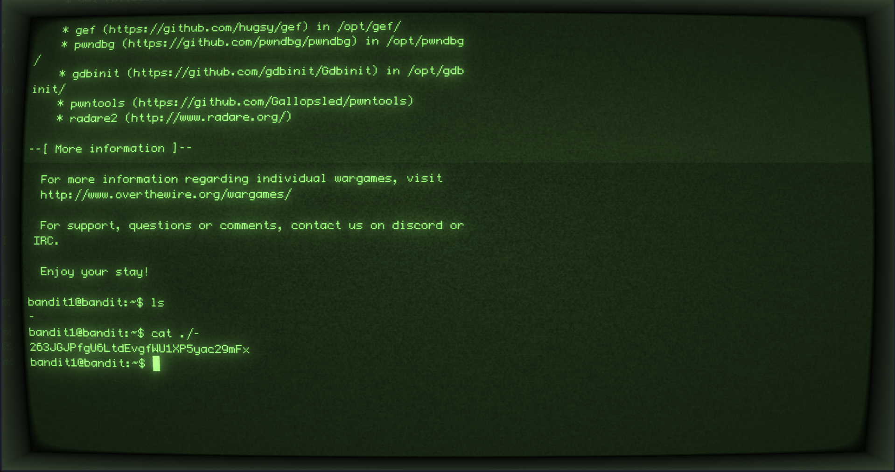


passwd: 263JGJPfgU6LtdEvgfWU1XP5yac29mFx

#	bandit3:

login:

	ssh -p 2220 bandit2@bandit.labs.overthewire.org

command for getting this password:

	cat ./"--spaces in this filename--"


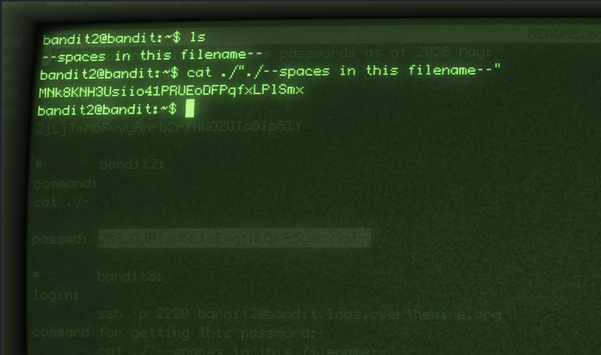


password obtained:

		MNk8KNH3Usiio41PRUEoDFPqfxLPlSmx


#	bandit4:

login:	 ssh -p 2220 bandit3@bandit.labs.overthewire.org


commands:

cat "...Hiding-From-You"	


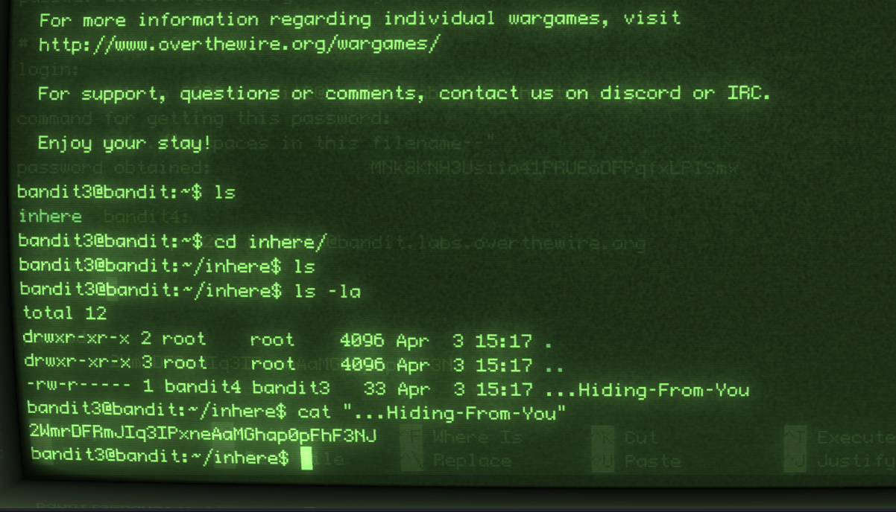


passwd for bandit5:

	2WmrDFRmJIq3IPxneAaMGhap0pFhF3NJ

# bandit 5

login:

	 ssh -p 2220 bandit4@bandit.labs.overthewire.org

commands:

	find . | xargs file | grep text 

// this command find any human readable file in the current directory


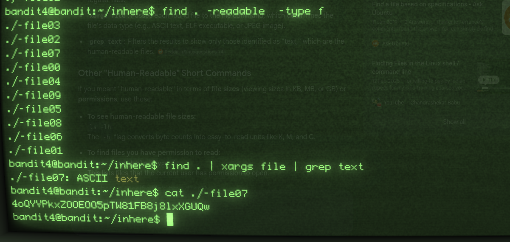


password for bandit 6:

	4oQYVPkxZOOEOO5pTW81FB8j8lxXGUQw

# 	bandit 6

login command:

	ssh -p 2220 bandit5@bandit.labs.overthewire.org

commands:

	find * -type f -size 1033c


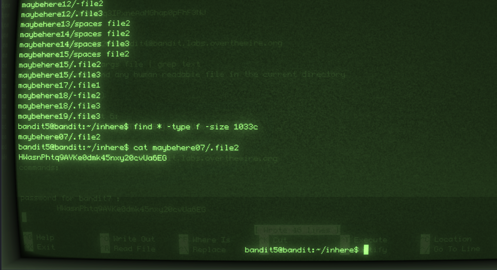


password for bandit7 :

	HWasnPhtq9AVKe0dmk45nxy20cvUa6EG

# bandit 7

login commands:

	 ssh -p 2220 bandit6@bandit.labs.overthewire.org

commands:

find / -type f -user bandit7 -group bandit6


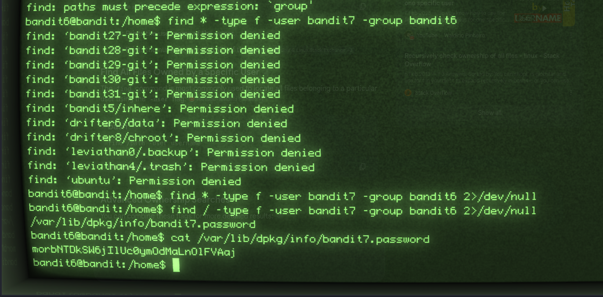


password for bandit 8:

	morbNTDkSW6jIlUc0ymOdMaLnOlFVAaj

# bandit 8 

GOAL:
```
Bandit Level 8 → Level 9
The password for the next level is stored in the file data.txt next to the word millionth
```

login:

 ssh -p 2220 bandit7@bandit.labs.overthewire.org


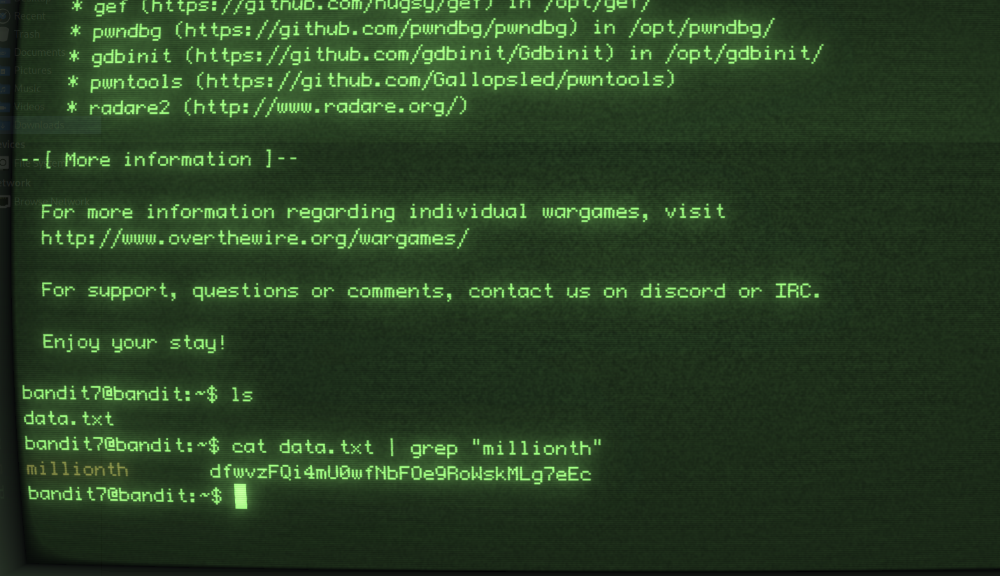


commands:

cat data.txt | grep "millionth"


password for bandit9:

	 dfwvzFQi4mU0wfNbFOe9RoWskMLg7eEc


# bandit 9


GOAL:
```
The password for the next level is stored in the file data.txt and is the only line of text that occurs only once
```


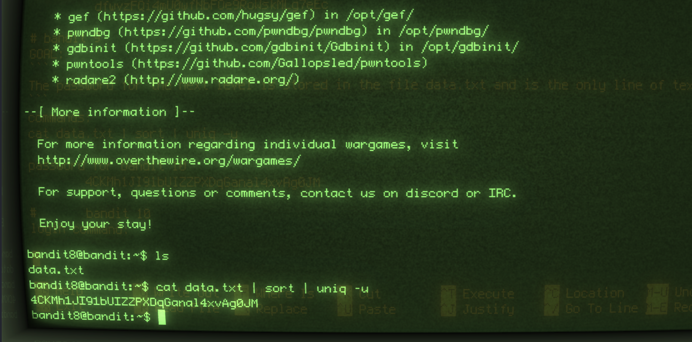


commands:

cat data.txt | sort | uniq -u


password for bandit 10

	4CKMh1JI91bUIZZPXDqGanal4xvAg0JM


#	bandit 10

login command:

	 ssh -p 2220 bandit9@bandit.labs.overthewire.org
GOAL
```
The password for the next level is stored in the file data.txt in one of the few human-readable strings, preceded by several ‘=’ characters.
```

Bandit Level 9 → Level 10

The password for the next level is stored in the file data.txt in one of the few human-readable strings, preceded by several ‘=’ characters.


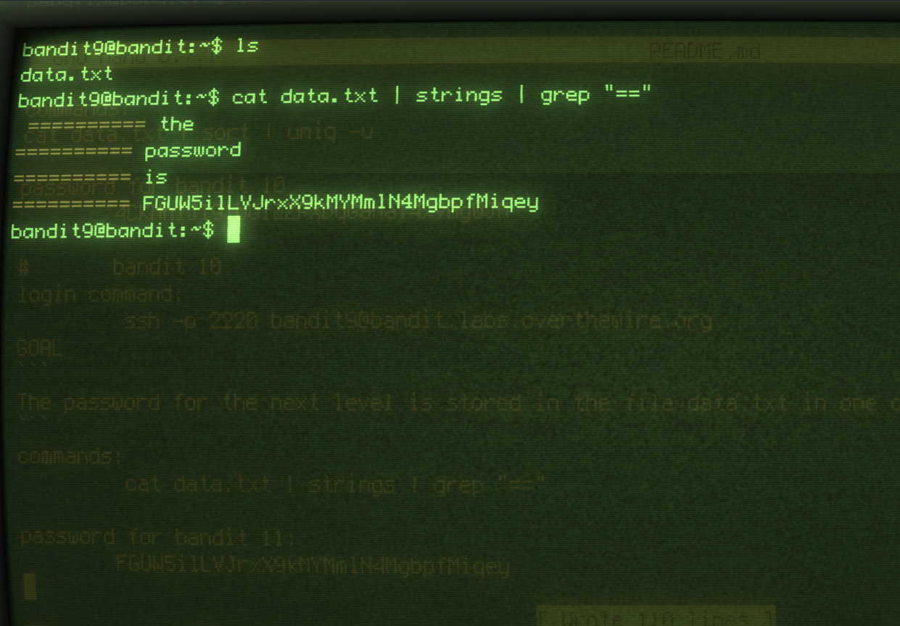


commands:

	 cat data.txt | strings | grep "=="


password for bandit 11:

	FGUW5ilLVJrxX9kMYMmlN4MgbpfMiqey


#	bandit 11


GOAL:

```
The password for the next level is stored in the file data.txt, which contains base64 encoded data
```

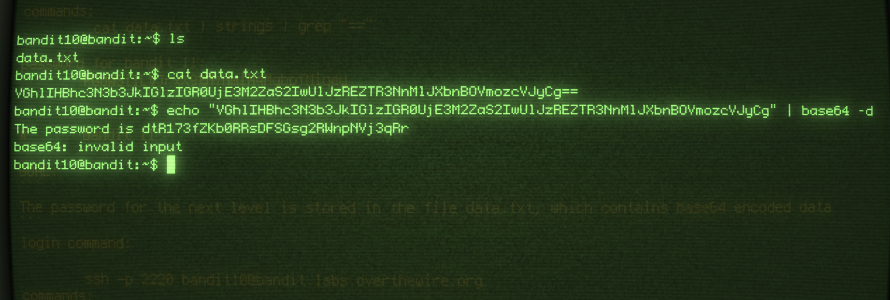

login command:

	ssh -p 2220 bandit10@bandit.labs.overthewire.org

commands:

echo "VGhlIHBhc3N3b3JkIGlzIGR0UjE3M2ZaS2IwUlJzREZTR3NnMlJXbnBOVmozcVJyCg" | base64 -d

password for bandit 12:

	dtR173fZKb0RRsDFSGsg2RWnpNVj3qRr

# bandit 12

GOAL:

```
Bandit Level 11 → Level 12
The password for the next level is stored in the file data.txt, where all lowercase (a-z) and uppercase (A-Z) letters have been rotated by 13 positions
```
login command:
	
 ssh -p 2220 bandit11@bandit.labs.overthewire.org

commands:


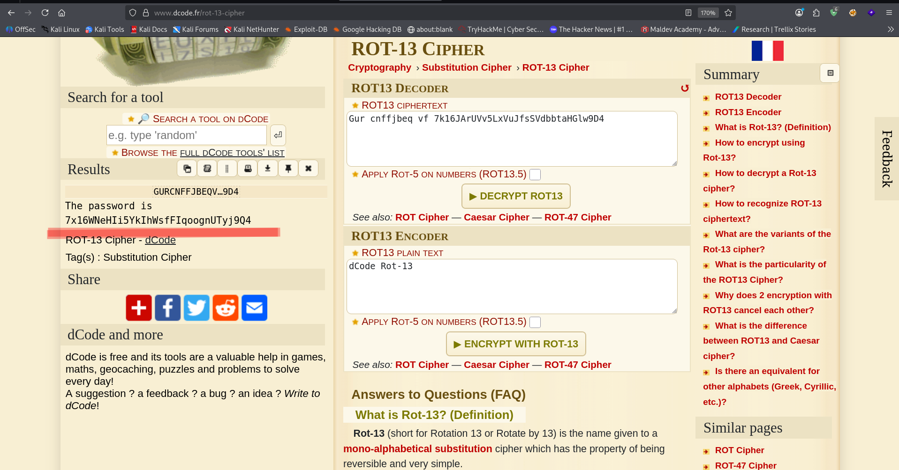


// site: https://www.dcode.fr/rot-13-cipher


rot-13

password for bandit 13:

	7x16WNeHIi5YkIhWsfFIqoognUTyj9Q4

#	bandit 13


GOAL:

```
The password for the next level is stored in the file data.txt, which is a hexdump of a file that has been repeatedly compressed. For this level it may be useful to create a directory under /tmp in which you can work. Use mkdir with a hard to guess directory name. Or better, use the command “mktemp -d”. Then copy the datafile using cp, and rename it using mv (read the manpages!)
```
Login command:

	 ssh -p 2220 bandit12@bandit.labs.overthewire.org

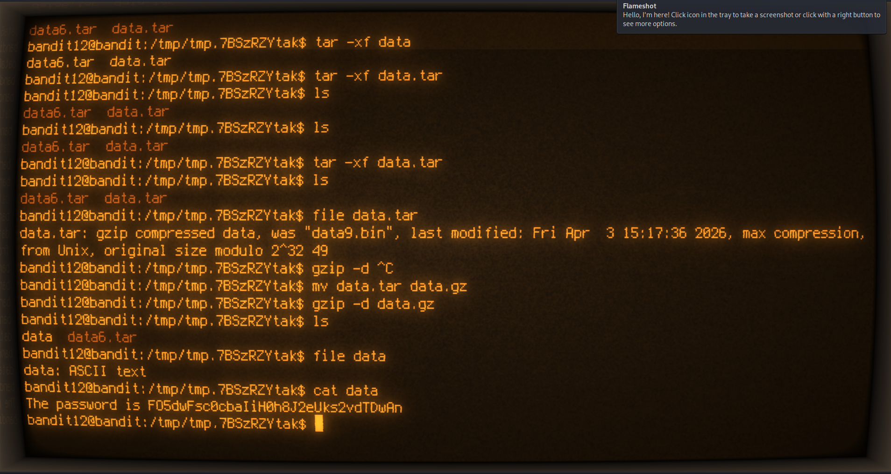

commands:
	xxd -r <data.txt> // to reverse it to binary
	
	bzip -d <file.bz>

	gzip -d <file.gz>
	
	tar -xf <file.tar>

password for bandit 14
	
	FO5dwFsc0cbaIiH0h8J2eUks2vdTDwAn


#	bandit 14


GOAL:

	Bandit Level 13 → Level 14
	The password for the next level is stored in /etc/bandit_pass/bandit14 and can only be read by user bandit14. For this level, you don’t get the next password, but you get a private SSH key that can be used to log into the next level. Look at the commands that logged you into previous bandit levels, and find out how to use the key for this level.
	If you need help with this level: a hint file can be found in the home directory.
	Make sure to read the error messages as they are informative.

login command:

	 ssh -p 2220 bandit13@bandit.labs.overthewire.org

commands:

	scp -P 2220 bandit13@@bandit.labs.overthewire.org:/home/bandit13/sshkey.private .

	// didn't really know that using scp you must specify port with -P 

	// login with the sshkey now

	// assign permission to the keysudo chmod 600 sshkey.private 

	ssh -p 2220 -i sshkey.private bandit14@bandit.labs.overthewire.org

	// cat /etc/bandit_pass/bandit14


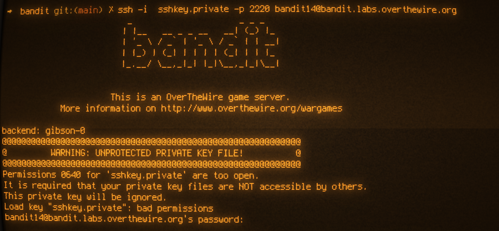


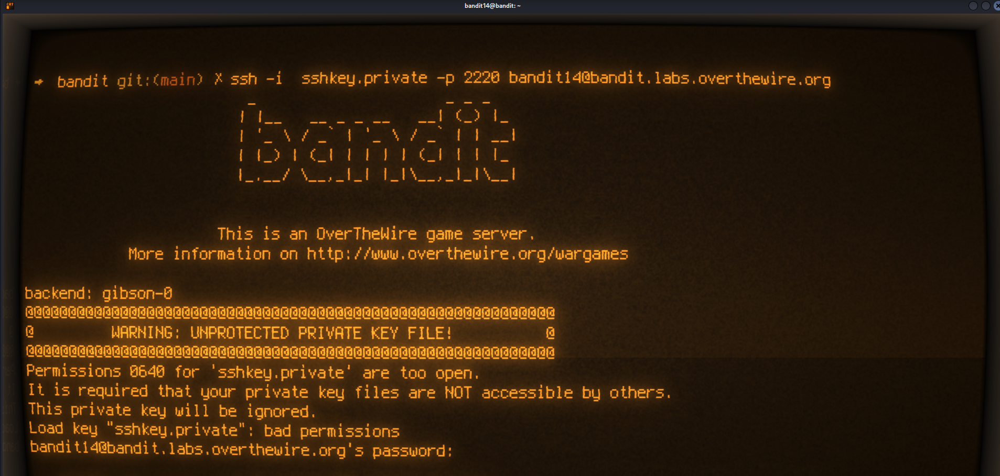


password for bandit 15:

	MU4VWeTyJk8ROof1qqmcBPaLh7lDCPvS


# bandit 15

GOAL:

	Bandit Level 14 → Level 15 ✅
	The password for the next level can be retrieved by submitting the password of the current level to port 30000 on localhost.

login command:

	ssh -p 2220 bandit14@bandit.labs.overthewire.org

commands:
nc localhost 30000

// submit password for bandit15 here

password for bandit 16:
	8xCjnmgoKbGLhHFAZlGE5Tmu4M2tKJQo

#	bandit 16

GOAL	
	Bandit Level 15 → Level 16 

	The password for the next level can be retrieved by submitting the password of the current level to port 30001 on localhost using SSL/TLS encryption
	
login commands:

commands:

openssl s_client -connect localhost:30001

// issue the password for bandit 16 when prompted with "read R BLOCK"


password for bandit17:
	kSkvUpMQ7lBYyCM4GBPvCvT1BfWRy0Dx

#	bandit 17

GOAL

	Bandit Level 16 → Level 17
	
	The credentials for the next level can be retrieved by submitting the password of the current level to a port on localhost in the range 31000 to 32000. First find out which of these ports have a server listening on them. Then find out which of those speak SSL/TLS and which don’t. There is only 1 server that will give the next credentials, the others will simply send back to you whatever you send to it.

login commands:
	
	 ssh -p 2220 bandit16@bandit.labs.overthewire.org


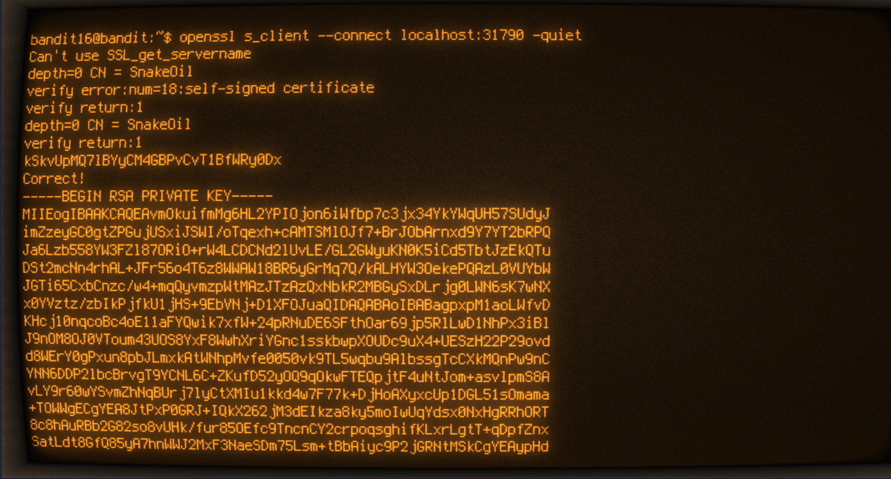


commands:
	openssl s_client --connect localhost:31790 -quiet

// didn't really know i should use "-quiet" commands since the password began with k it was treated as KEYUPDATE


password for bandit 18:
	
// RSA KEY 

"""
	MIIEogIBAAKCAQEAvmOkuifmMg6HL2YPIOjon6iWfbp7c3jx34YkYWqUH57SUdyJ
	imZzeyGC0gtZPGujUSxiJSWI/oTqexh+cAMTSMlOJf7+BrJObArnxd9Y7YT2bRPQ
	Ja6Lzb558YW3FZl87ORiO+rW4LCDCNd2lUvLE/GL2GWyuKN0K5iCd5TbtJzEkQTu
	DSt2mcNn4rhAL+JFr56o4T6z8WWAW18BR6yGrMq7Q/kALHYW3OekePQAzL0VUYbW
	JGTi65CxbCnzc/w4+mqQyvmzpWtMAzJTzAzQxNbkR2MBGySxDLrjg0LWN6sK7wNX
	x0YVztz/zbIkPjfkU1jHS+9EbVNj+D1XFOJuaQIDAQABAoIBABagpxpM1aoLWfvD
	KHcj10nqcoBc4oE11aFYQwik7xfW+24pRNuDE6SFthOar69jp5RlLwD1NhPx3iBl
	J9nOM8O0VToum43UOS8YxF8WwhXriYGnc1sskbwpXOUDc9uX4+UESzH22P29ovd
	d8WErY0gPxun8pbJLmxkAtWNhpMvfe0050vk9TL5wqbu9AlbssgTcCXkMQnPw9nC
	YNN6DDP2lbcBrvgT9YCNL6C+ZKufD52yOQ9qOkwFTEQpjtF4uNtJom+asvlpmS8A
	vLY9r60wYSvmZhNqBUrj7lyCtXMIu1kkd4w7F77k+DjHoAXyxcUp1DGL51sOmama
	+TOWWgECgYEA8JtPxP0GRJ+IQkX262jM3dEIkza8ky5moIwUqYdsx0NxHgRRhORT
	8c8hAuRBb2G82so8vUHk/fur85OEfc9TncnCY2crpoqsghifKLxrLgtT+qDpfZnx
	SatLdt8GfQ85yA7hnWWJ2MxF3NaeSDm75Lsm+tBbAiyc9P2jGRNtMSkCgYEAypHd
	HCctNi/FwjulhttFx/rHYKhLidZDFYeiE/v45bN4yFm8x7R/b0iE7KaszX+Exdvt
	SghaTdcG0Knyw1bpJVyusavPzpaJMjdJ6tcFhVAbAjm7enCIvGCSx+X3l5SiWg0A
	R57hJglezIiVjv3aGwHwvlZvtszK6zV6oXFAu0ECgYAbjo46T4hyP5tJi93V5HDi
	Ttiek7xRVxUl+iU7rWkGAXFpMLFteQEsRr7PJ/lemmEY5eTDAFMLy9FL2m9oQWCg
	R8VdwSk8r9FGLS+9aKcV5PI/WEKlwgXinB3OhYimtiG2Cg5JCqIZFHxD6MjEGOiu
	L8ktHMPvodBwNsSBULpG0QKBgBAplTfC1HOnWiMGOU3KPwYWt0O6CdTkmJOmL8Ni
	blh9elyZ9FsGxsgtRBXRsqXuz7wtsQAgLHxbdLq/ZJQ7YfzOKU4ZxEnabvXnvWkU
	YOdjHdSOoKvDQNWu6ucyLRAWFuISeXw9a/9p7ftpxm0TSgyvmfLF2MIAEwyzRqaM
	77pBAoGAMmjmIJdjp+Ez8duyn3ieo36yrttF5NSsJLAbxFpdlc1gvtGCWW+9Cq0b
	dxviW8+TFVEBl1O4f7HVm6EpTscdDxU+bCXWkfjuRb7Dy9GOtt9JPsX8MBTakzh3
	vBgsyi/sN3RqRBcGU40fOoZyfAMT8s1m/uYv52O6IgeuZ/ujbjY=
"""

#		bandit 18

GOAL:
	Bandit Level 17 → Level 18
	There are 2 files in the homedirectory: passwords.old and passwords.new. The password for the next level is in passwords.new and is the only line that has been changed between passwords.old and passwords.new

commands:

	diff passwords.new passwords.old 

login command:

	ssh -p 2220 -i key_ssh bandit17@bandit.labs.overthewire.org


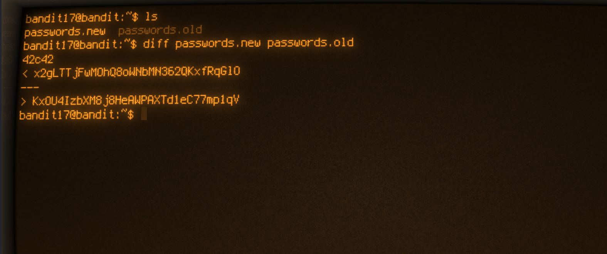

password for bandit 19:

	x2gLTTjFwMOhQ8oWNbMN362QKxfRqGlO	

#	bandit 19

GOAL:

	The password for the next level is stored in a file readme in the homedirectory. Unfortunately, someone has modified .bashrc to log you out when you log in with SSH.

login commands:

	ssh -p 2220  bandit18@bandit.labs.overthewire.org


commands:

scp -p 2220 bandit18@bandit.labs.overthewire.org:/home/bandit18/readme .


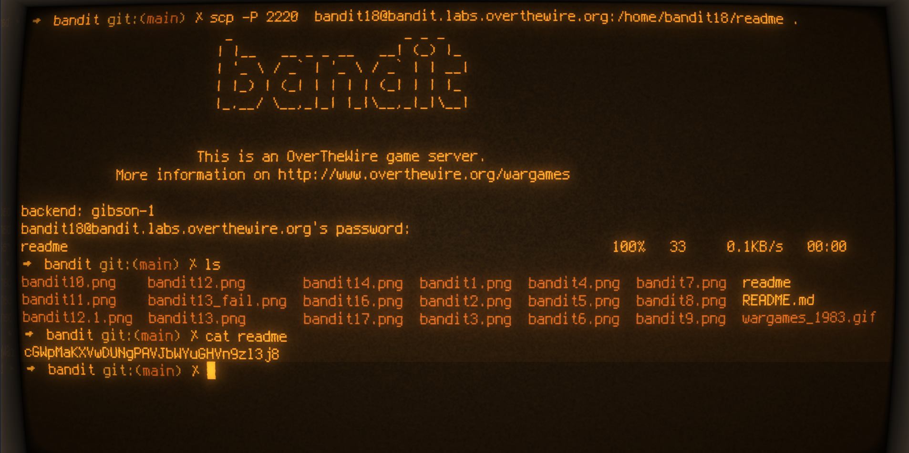

password for bandit20:
	cGWpMaKXVwDUNgPAVJbWYuGHVn9zl3j8

# 	bandit 20

GOAL:
	To gain access to the next level, you should use the setuid binary in the homedirectory. Execute it without arguments to find out how to use it. The password for this level can be found in the usual place (/etc/bandit_pass), after you have used the setuid binary.

login command:

	ssh -p 2220 bandit19@bandit.labs.overthewire.org


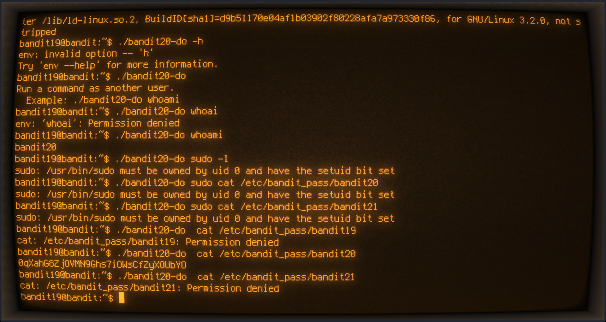

commands:
	
	./bandit20-do  cat /etc/bandit_pass/bandit20

password for bandit 21:
	0qXahG8ZjOVMN9Ghs7iOWsCfZyXOUbYO


# 	bandit 21

GOAL:

	There is a setuid binary in the homedirectory that does the following: it makes a connection to localhost on the port you specify as a commandline argument. It then reads a line of text from the connection and compares it to the password in the previous level (bandit20). If the password is correct, it will transmit the password for the next level (bandit21).

login commands:
	        ssh -p 2220 bandit20@bandit.labs.overthewire.org	


password for bandit 22:
