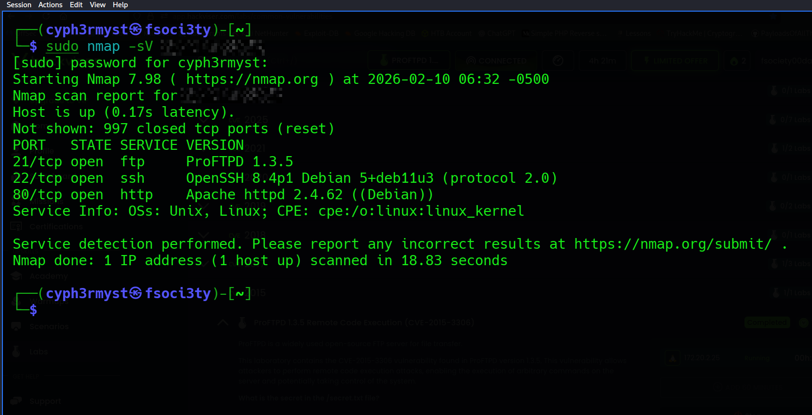
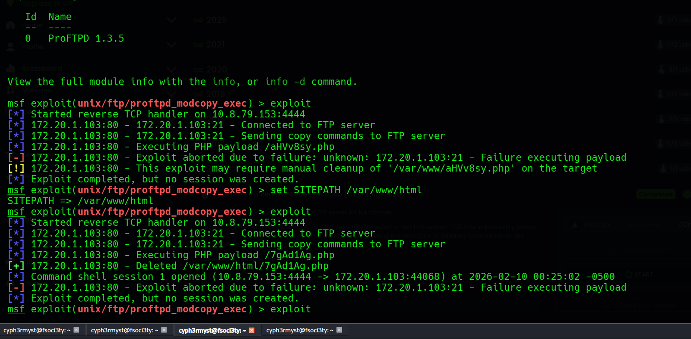
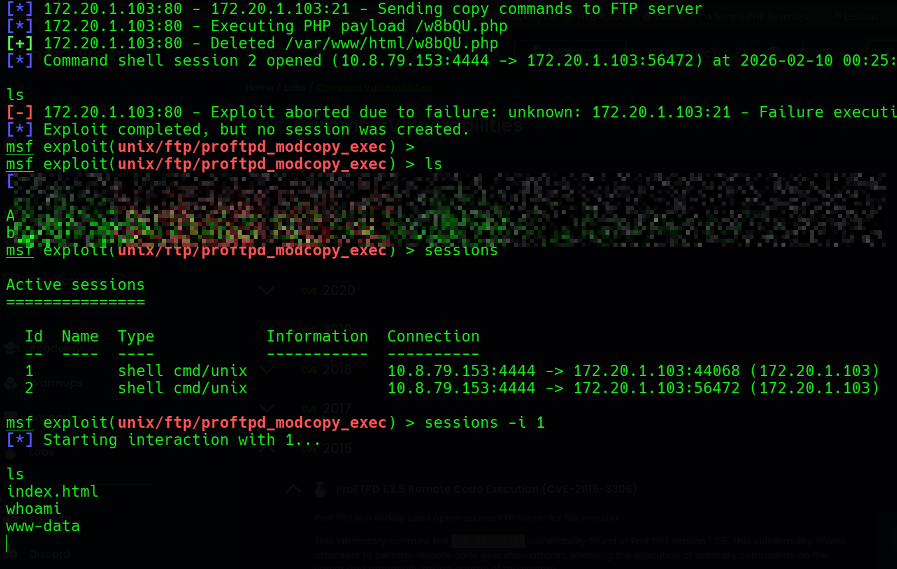
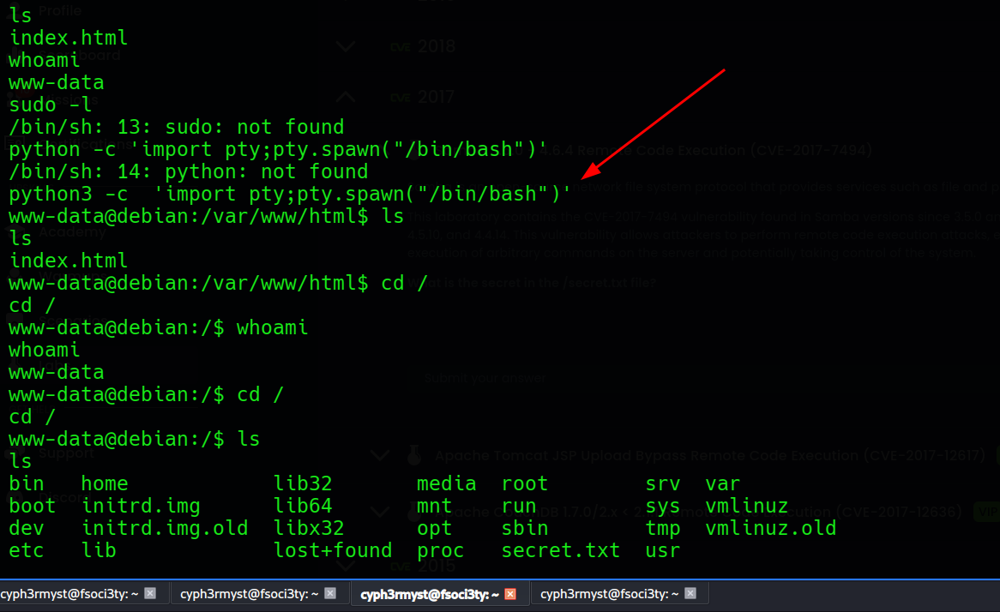
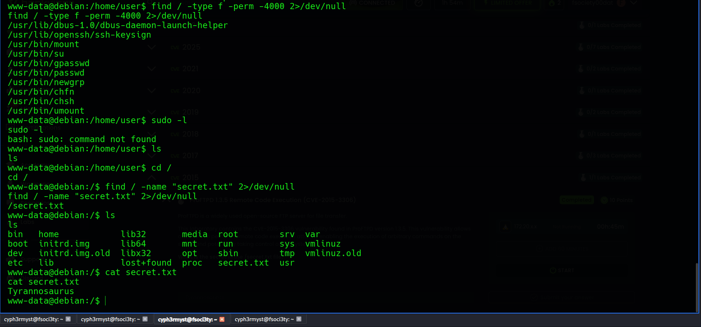

Target OS: linux

Date:  10/02/2026

Objective: Exploit and read contents of /secret.txt

RECON:
Nmap scan revealed the target system was running the following port with one port 21 "Pro-FTPD" being of interest.

Port 80 was running the default Apache site so the focus shifted to port 21.


Exploitation:
ProFTPD is vulnerable to CVE-2015-3306 
```sh
BREAKDOWN OF THE VULNERABILITY

The vulnerability gives an attacker the ability to copy files as server
bypassing normal permissions checks.If the attacker can copy attacker-controlled content into a location that is executed or interpreted by another service,the attacker will gain code execution and potentially system access.

Could be done through:
	- web server -- main focus for this challenge
	  - copying to ssh authorized keys
	    - service config overwrites
	      - 

```
Looking for an exploit found this exlploit in metasploit which i used to gain access:

At first the exploit fails since it can't write the **php** payload into */var/www*  directory hence it needs to be set to a directory where the webserver can execute the php payload leading to system compromise.
Gaining access:


Spawning a shell using python:

Objective:
```sh
**What is the secret in the /secret.txt file?**
```


