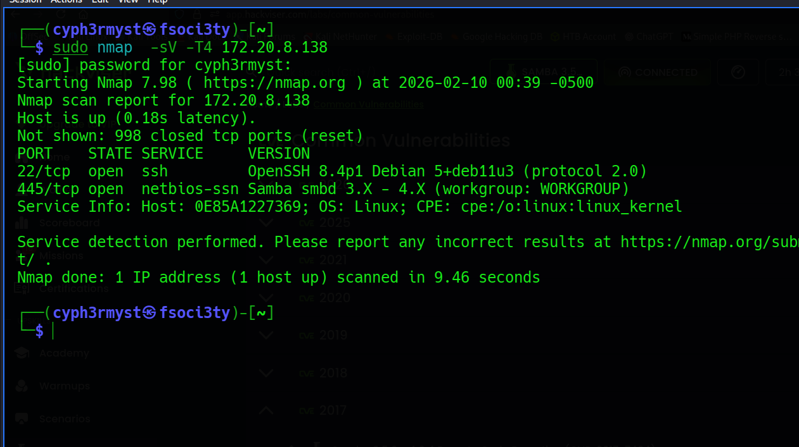
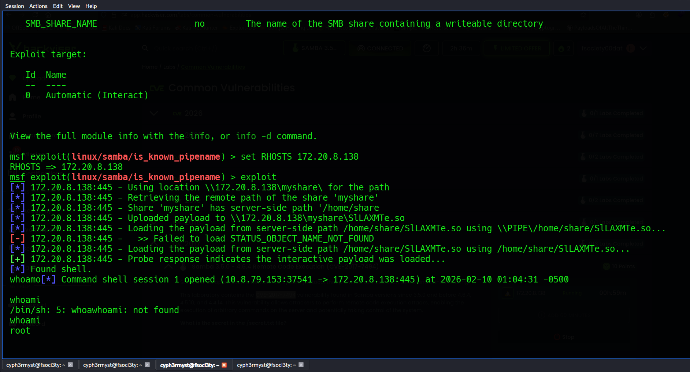
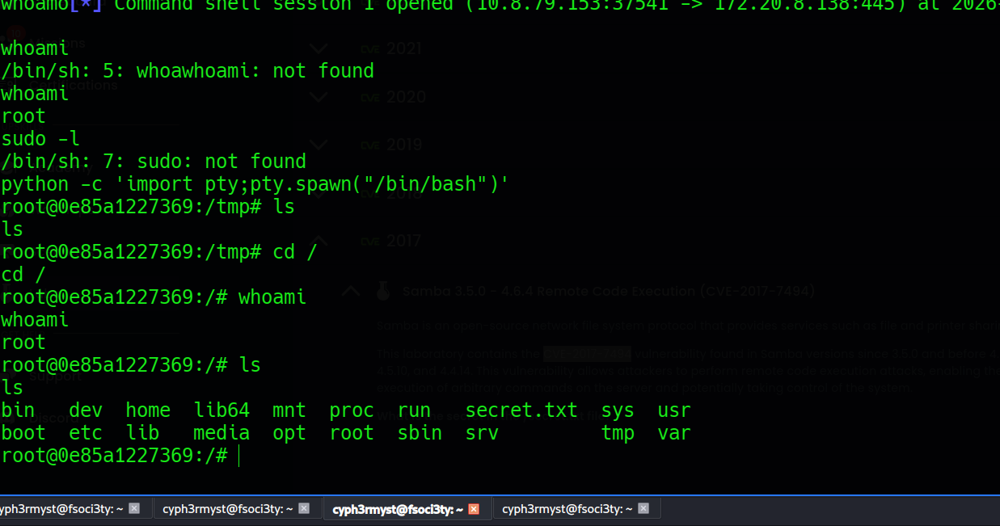
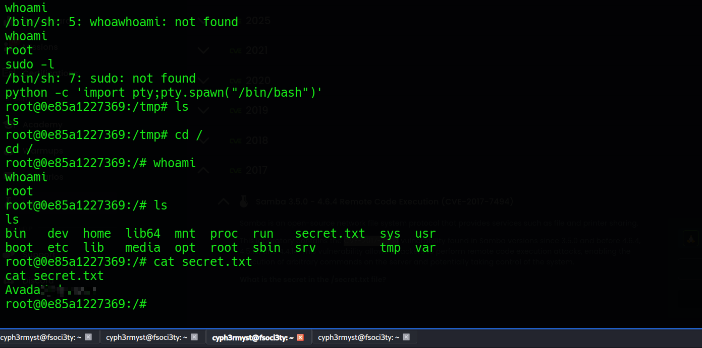

This system exposed the **samba-cry** vulnerability,just came shortly after **Wannacry** which affected unpatched-windows 7 systems.


Target OS: linux

Date: 10/02/2026

Objective: 
```sh
What is the secret in the /secret.txt file?
```

RECON

Nmap scan:




The nmap scan revealed that the target was running an old version of samba -- a  file server **enables file sharing across different operating systems over a network**. It lets you access your desktop files from a laptop and share files with Windows and macOS users.

EXPLOITATION

There is a known vulnerability of samba marked:
CVE-2017-7494.
```sh
VULNERABILITY DESCRIPTION

A samba server exposes a shared folder over SMB.if the samba version is vulnerable and the attacker as write access to the share,they can upload makicious *.so* file.The vulnerability forces samba to load that file as a shared library module.Because samba runs with high privileges{often root},the malicious code is executed,resulting in full system compromise.
```

A good working exploit for this in metasploit is:
```sh
exploit/linux/samba/is_known_pipename
```
Gaining access:


PRIVILEGE ESCALATION

Since the samba service was running as root, we gain access to a root user account.


COMPLETING THE OBJECTIVE:
The objective was to read the conects of /secret.txt

