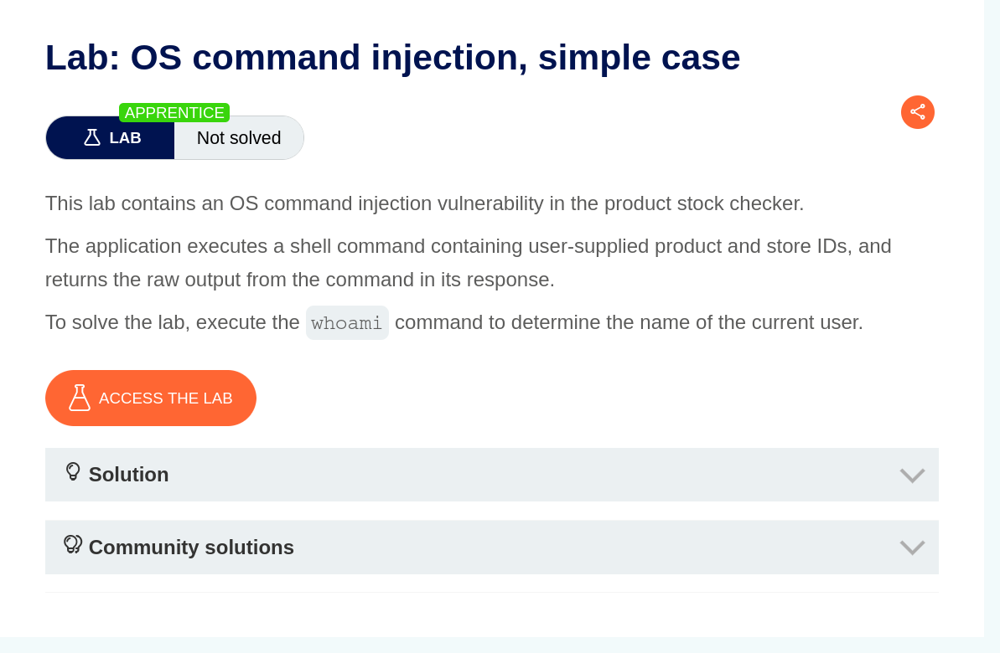
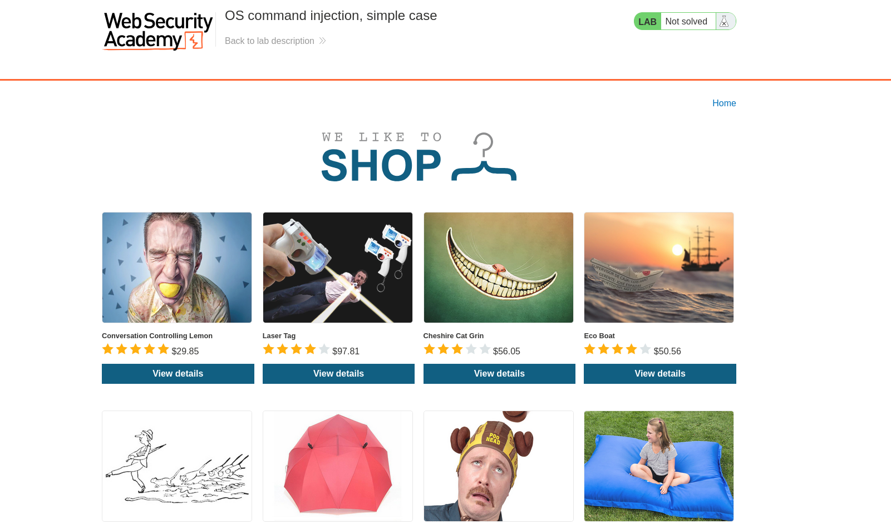
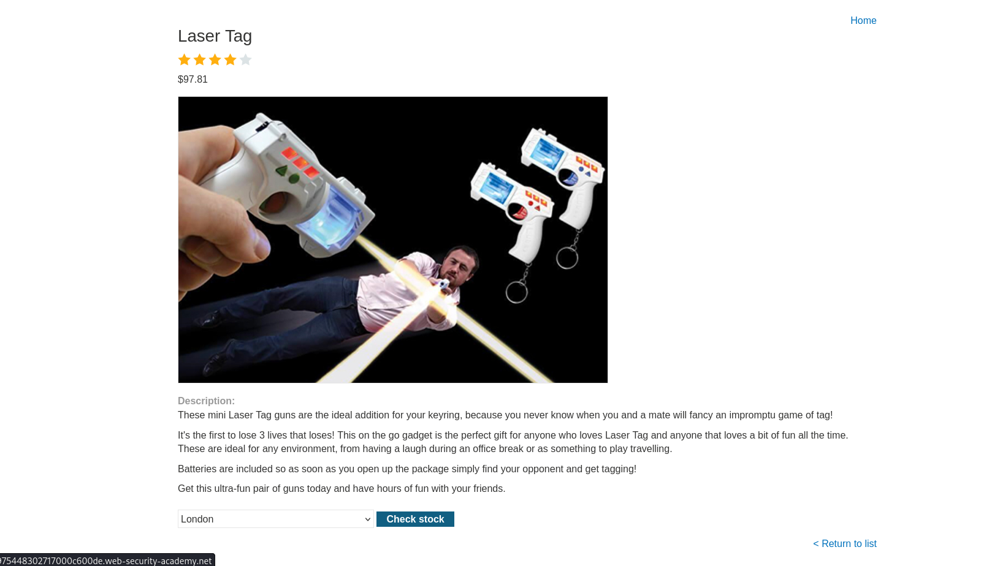
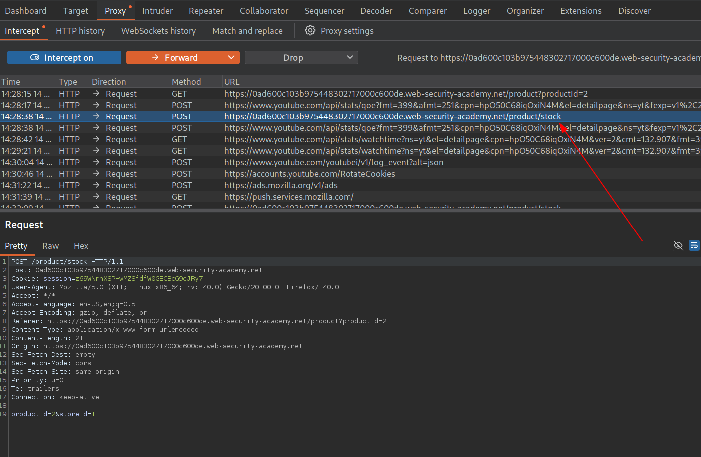
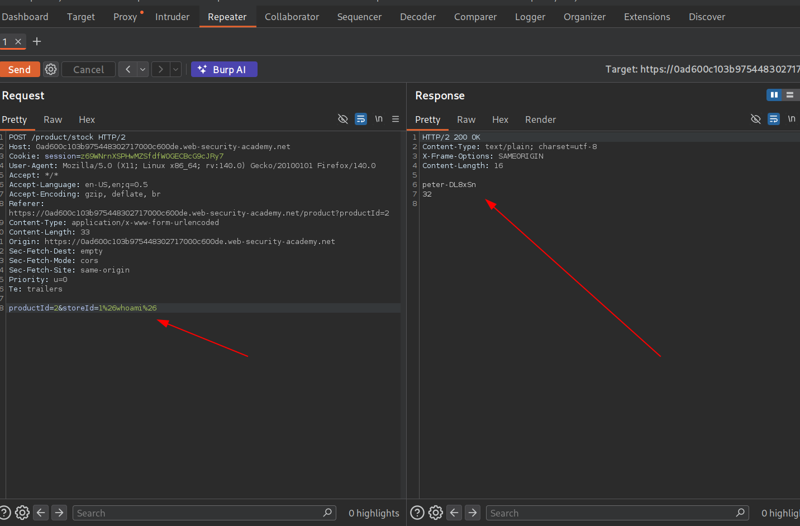
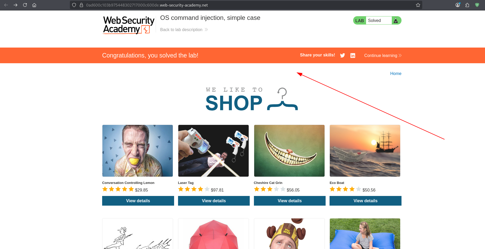
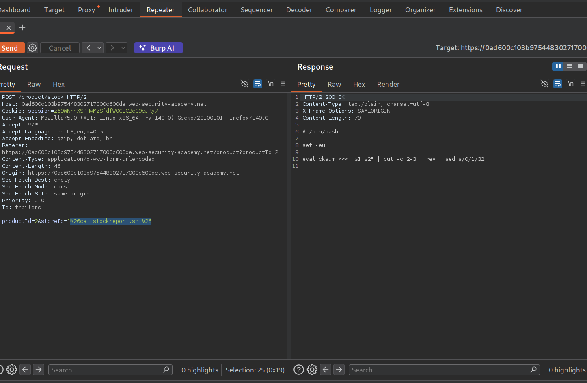
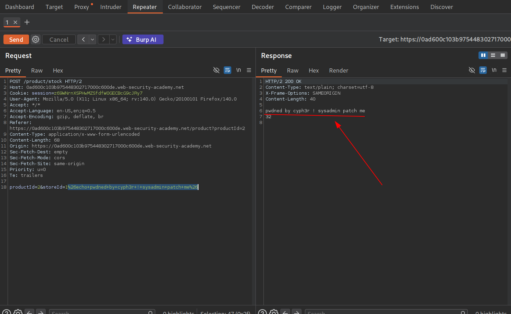

TARGET:  https://0abf000404692ac883bedcab0029004b.web-security-academy.net/

PLATFORM:  PortSwigger

DIFFICULTY:  Apprentice

DATE: 18/03/2026

OBJECTIVE: 
```
execute "whoami" on the system and determine the user os the system
```

LAB:



RECON

This site is an e-comerce site.



Navigating the site,found this feature which  i suspect could be running os commands in the background to check stock.So we intercept its request.



The request had two parts which request for : productId and StoreId




EXPLOITATION


We try both fields to see if any is vulnerable to command injection and the storeId field returns some good info so we use it to complete the objective.



Completed the objective !!!



**What if?**
Out of curiosity i just wanted to see what else i could do on the system and 😂

Dump contents of a script.




