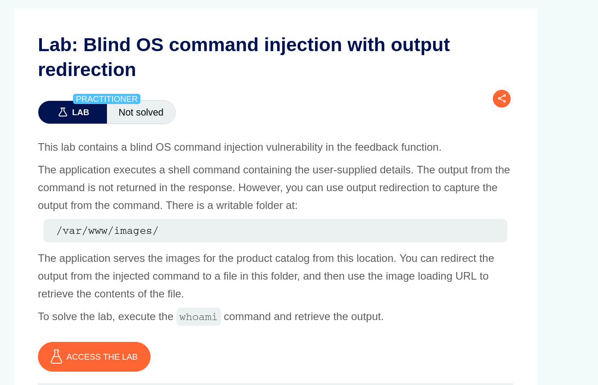
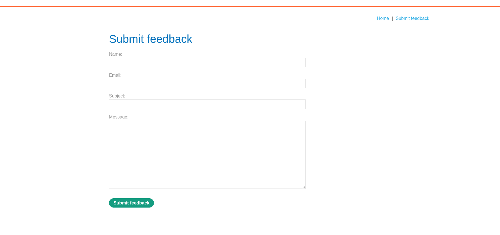
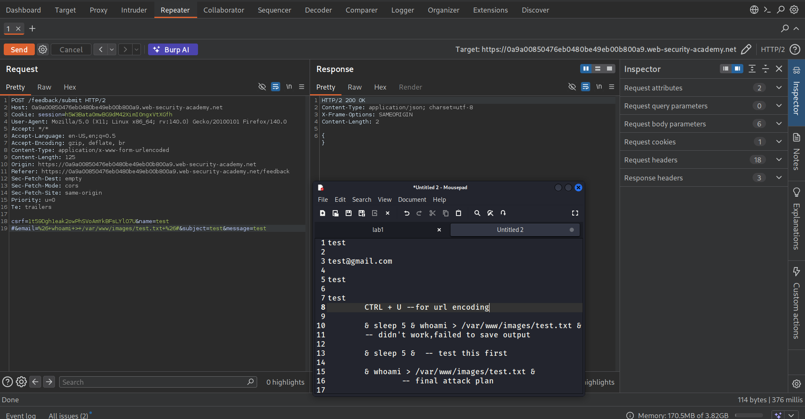
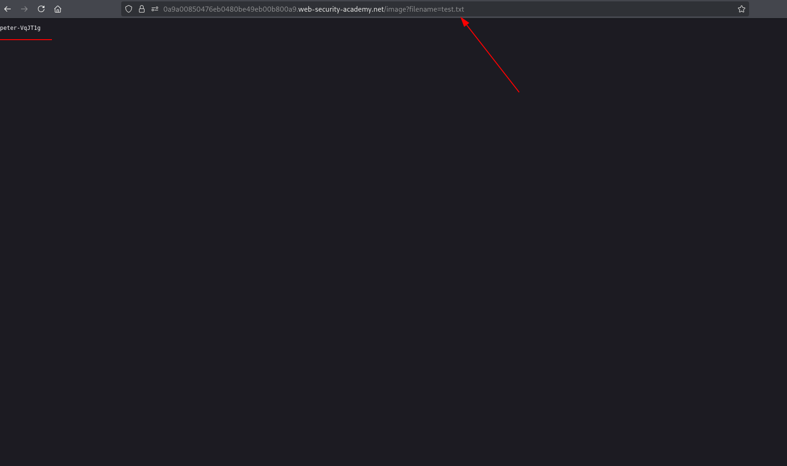
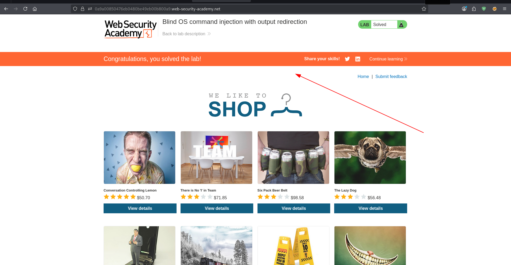

TARGET: [https://0abf000404692ac883bedcab0029004b.web-security-academy.net/](https://0abf000404692ac883bedcab0029004b.web-security-academy.net/)

PLATFORM: PortSwigger

DIFFICULTY: PRACTIONER

DATE: 18/03/2026

OBJECTIVE:
```
blind command injection -- use it to output of "whoami" command in a file that could be accessed in a writeable directory.

```


LAB 



RECON

Its an e-commerce site running.


Now our target again is the "submit feedback function" on 



EXPLOITATION

Methodology:
```
- Capture the request with burp and send it to repeater.
- Test for any identifiable ways to detect the blind os injection vulnerability.
  sample ways: & sleep 10 & -- enough time to notice any responses

- Execute the command and write the output to "test.txt" and try to access it via /var/www/images directory

```



Now accessing the file "test.txt" via /var/www/images.



Completing the objective !!! 


