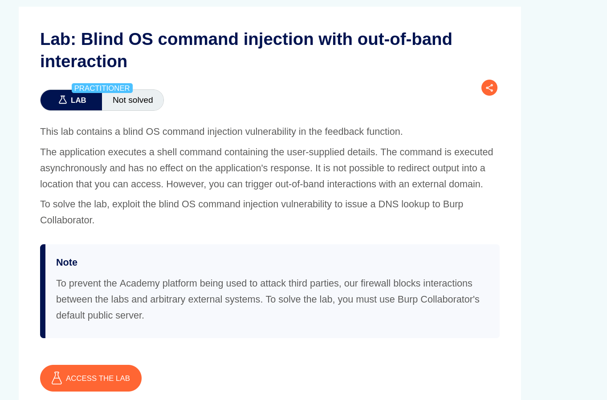
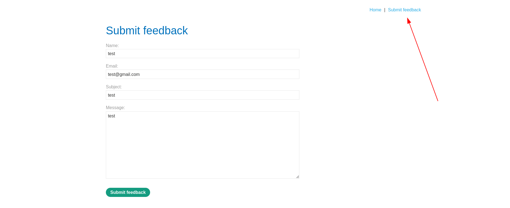
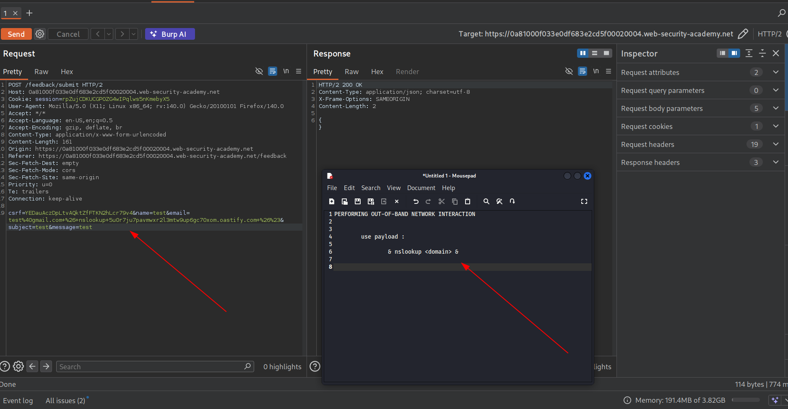
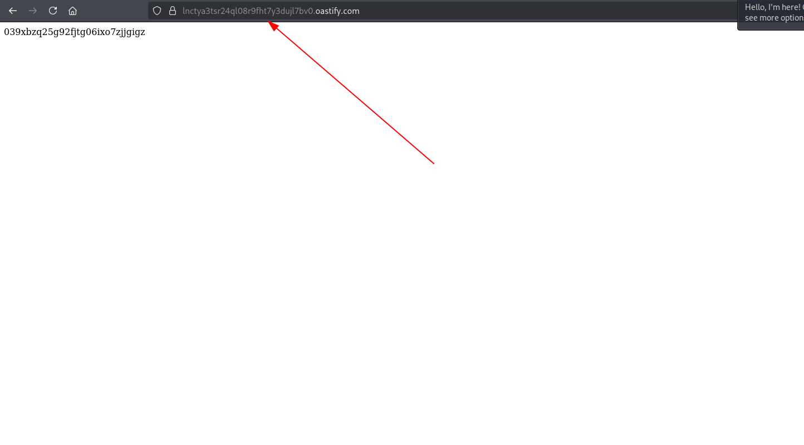
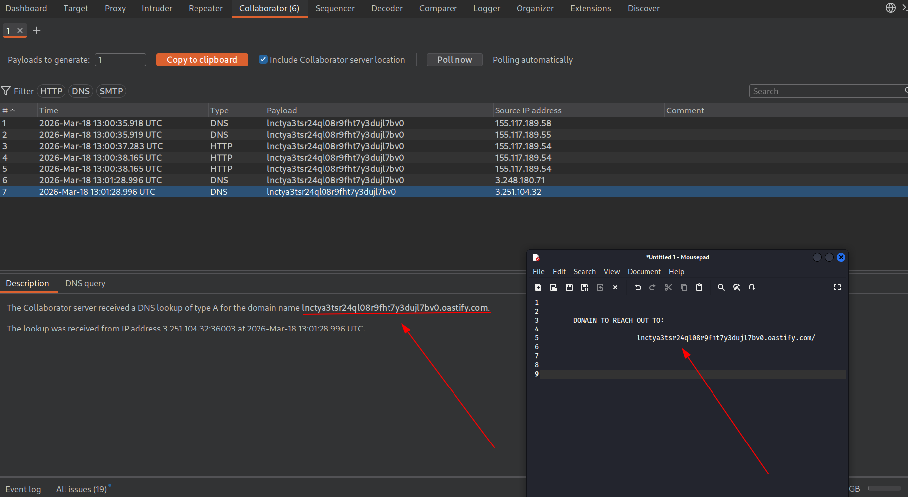
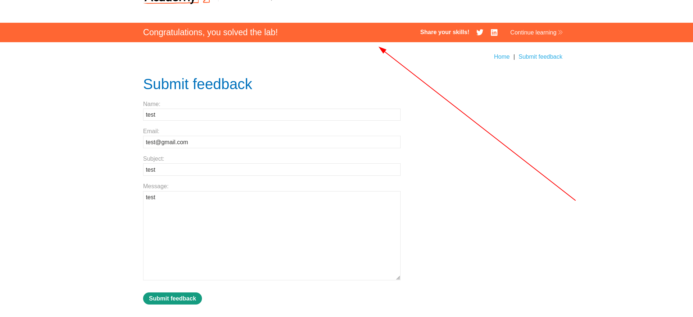

TARGET: https://28373a29dcfsg2ac883bedcab0029004b.web-security-academy.net/


PLATFORM: PortSwigger

DIFFICULTY: PRACTIONER

DATE: 18/03/2026

OBJECTIVE:

```
- simple ! : just do an nslookup on burp collaborator domain -- since their firewall is blocking any kind of external lookups.
  
```



RECON 

The same e-commerce site we've  been having.

Our target is the "submit feedback " function on the site.



EXPLOITATION

Capture the request,send it to repeater and weaponize it.



Our domain for the lookup is:



Send the request and wait for the response in burp collaborator.

Finished the objective:






