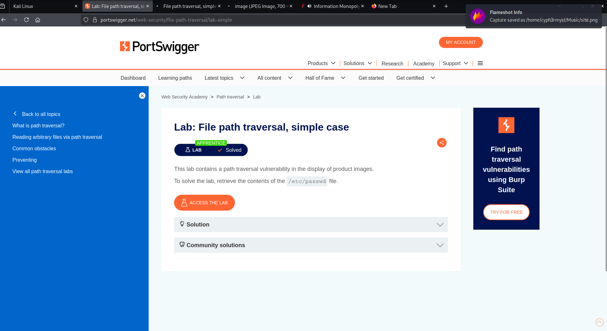
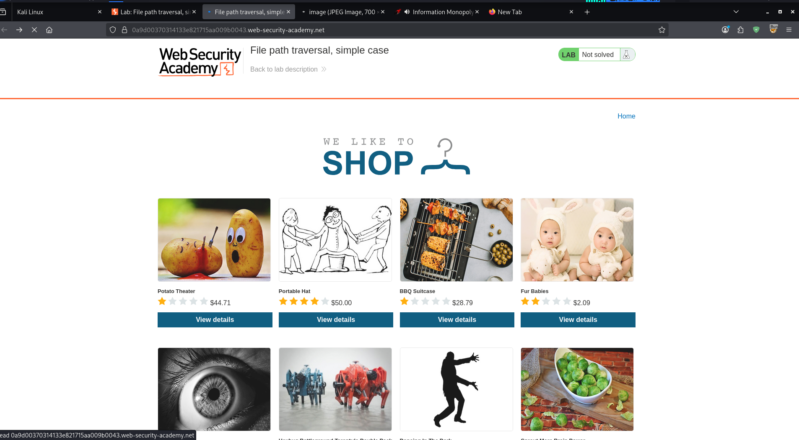
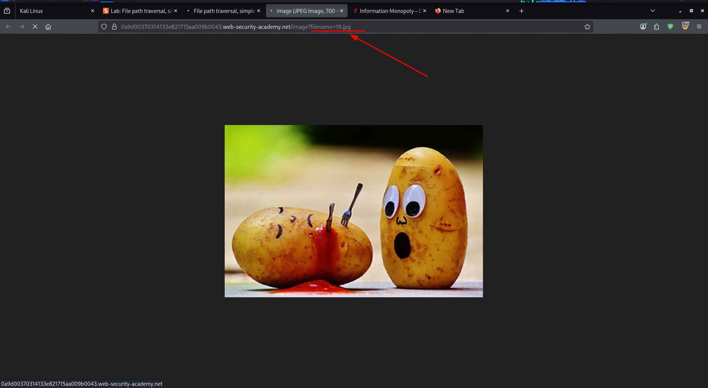
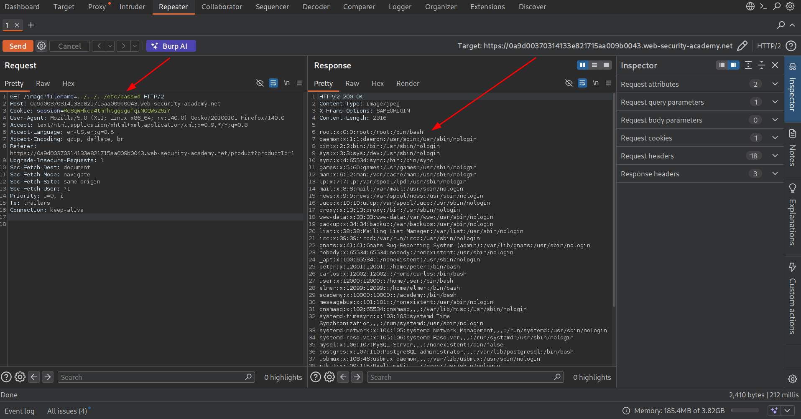
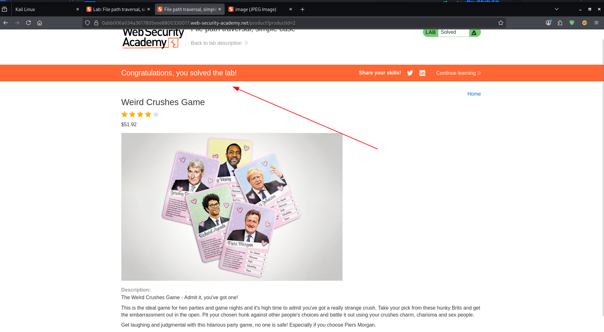

Date: 12/02/2026

Topic: Path Traversal

Level: APPRENTICE

This lab tested basic  path traversal skills.
The objective was to retrieve the contents of:
```
/etc/passwd file
```


RECON

Navigate to the target site which is an E-commerce site:



Now where it gets interesting is that the files in the site are revealed in the filename query.

```
.web-security-academy.net/image?filename=19.jpg
```



Now this is interesting because if we capture the request in burp proxy and send it to **Repeater** its possible to see what the site is revealing.

Having that it was possible to modify the request and retrieve that contents of /etc/passwd



Now having done that we had achieved the final objective:



