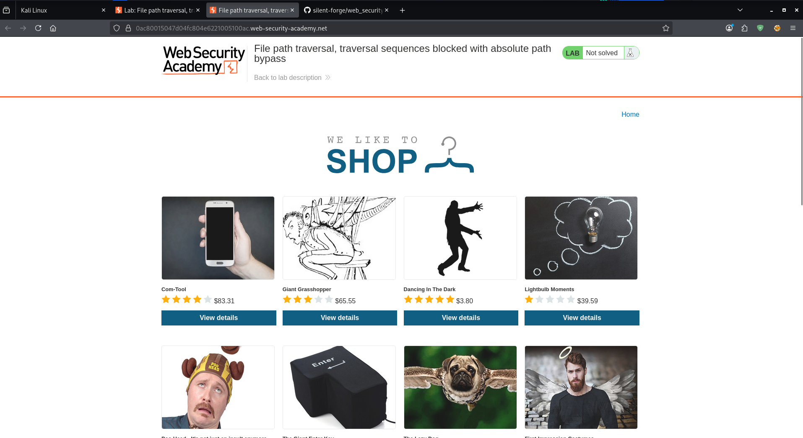
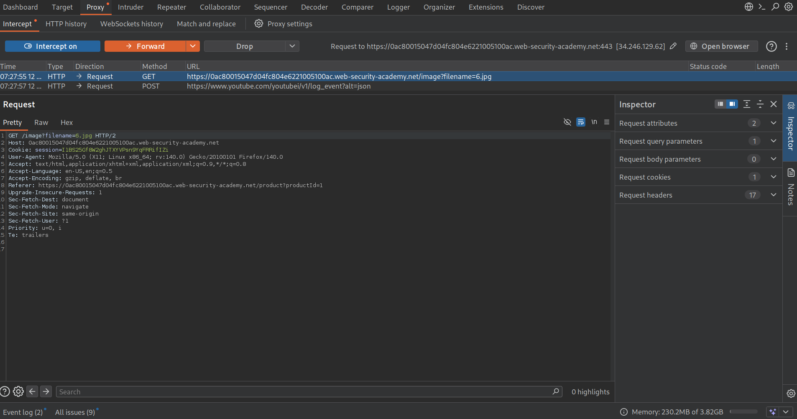
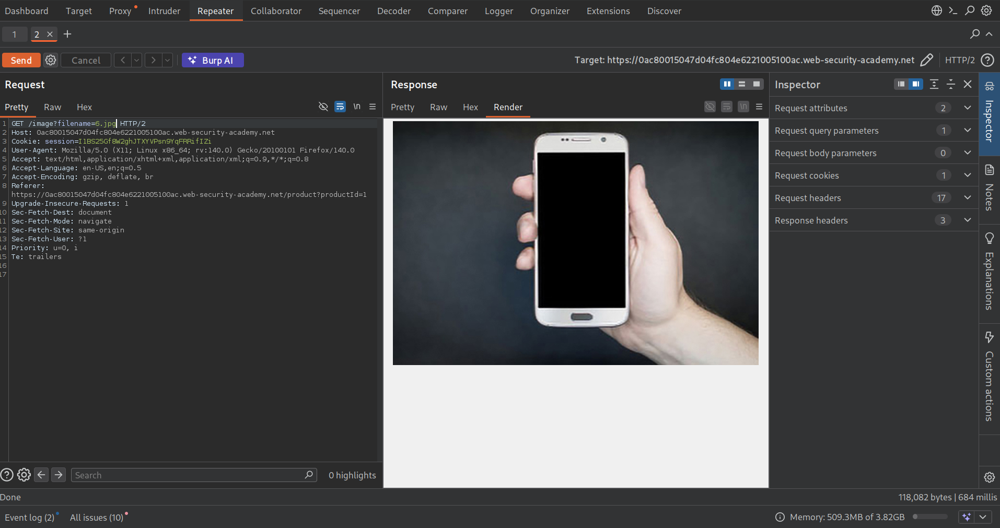
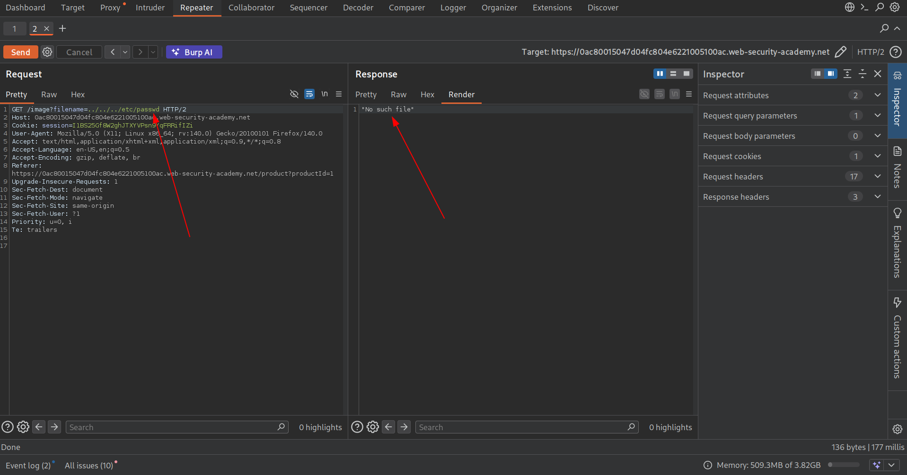
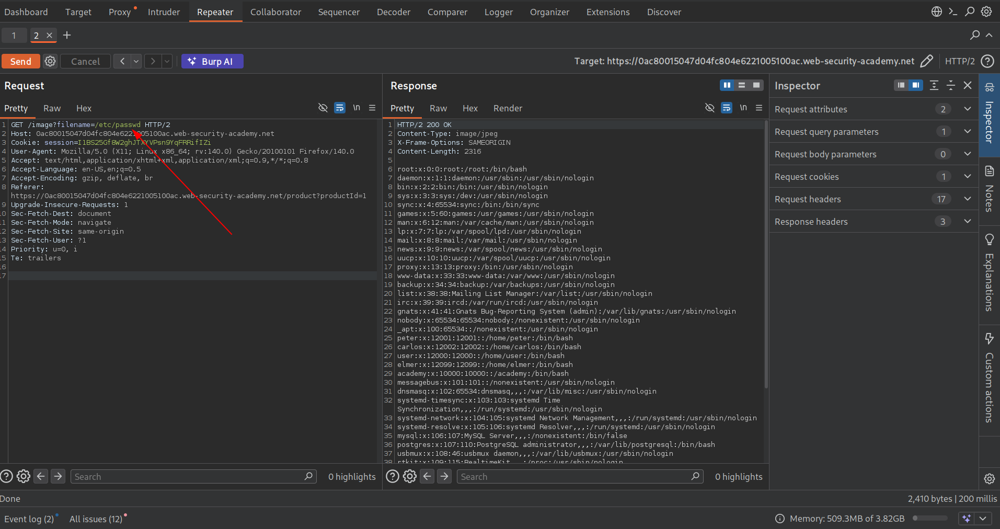

Target: "https://0ac80015047d04fc804e6221005100ac.web-security-academy.net"

Platform: Portwigger Labs

Difficulty: PRACTITIONER

DATE: 12/02/2026

RECON

The site is similar to the previous lab 1,( an e-commerce site).



The normal request reveals the image query:
```
/image?filename=9.jpg
```



Now we send this request to repeater and see what we can get in response:

Which revealed :



Now with this lets try basic path traversal by adding ** ../../../etc/passwd ** to the image query.



Lets see if the site strips of the absolute path then:

Payload: 
```
/etc/passwd

```



This works showing that developers prevented users accessing  file by stripping off the absolute path yet it still can be used  for path traversal.

