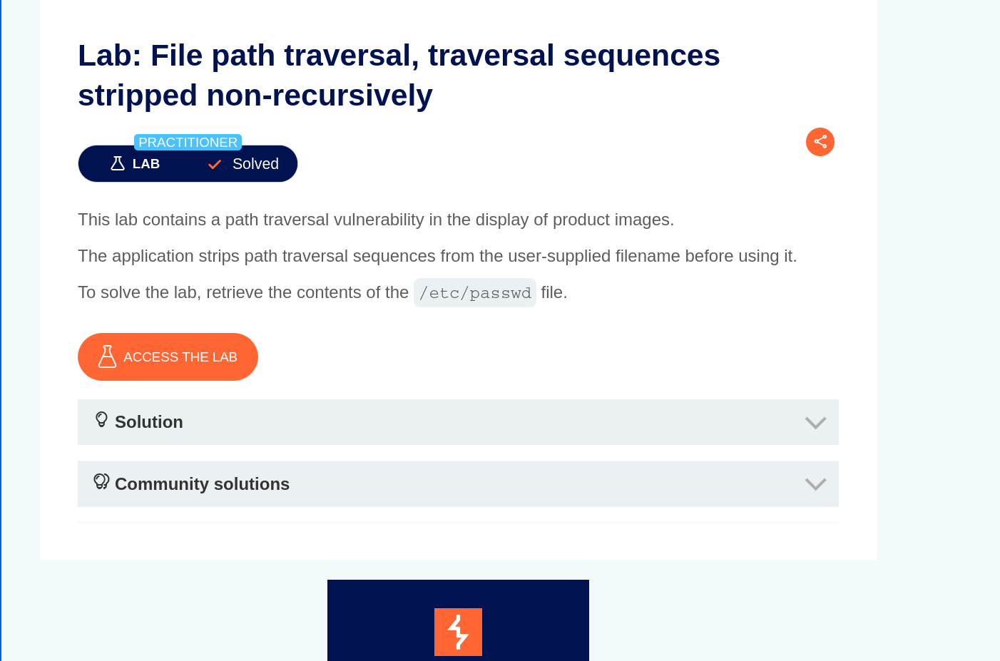
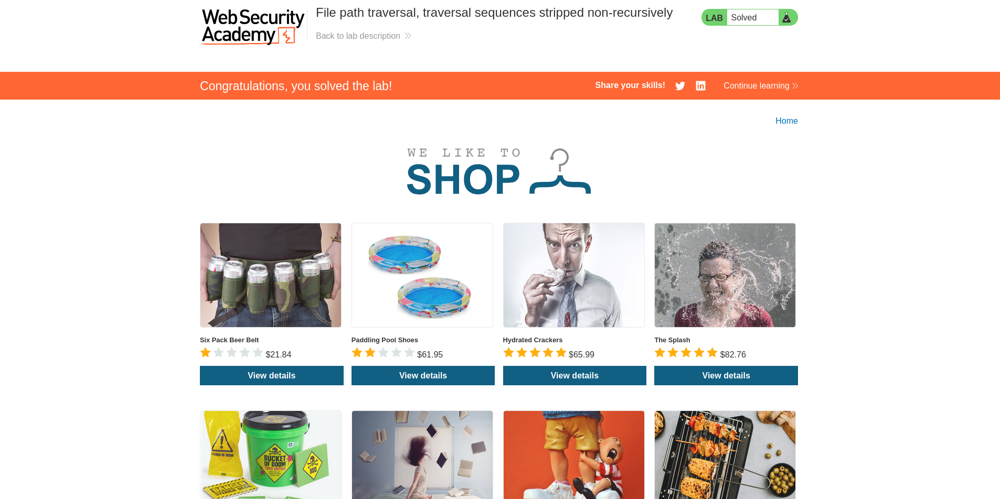
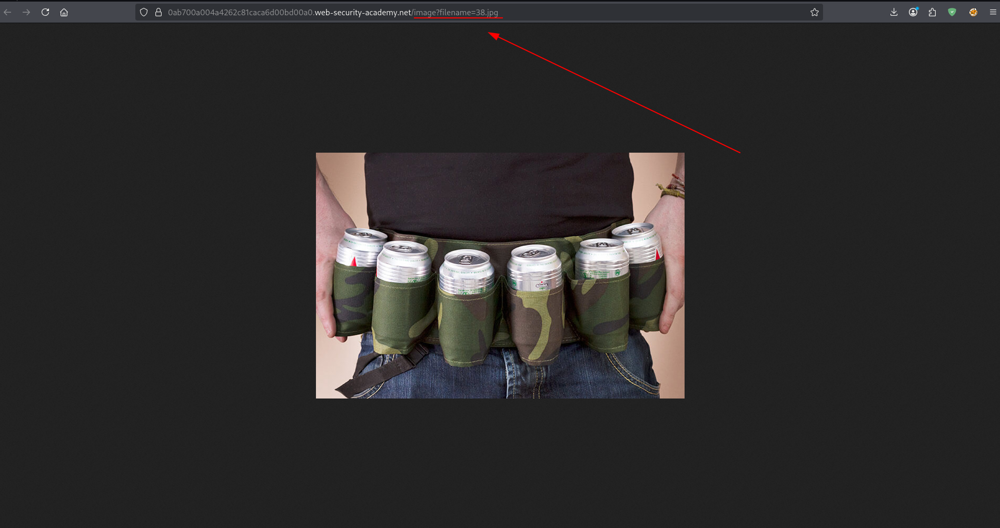
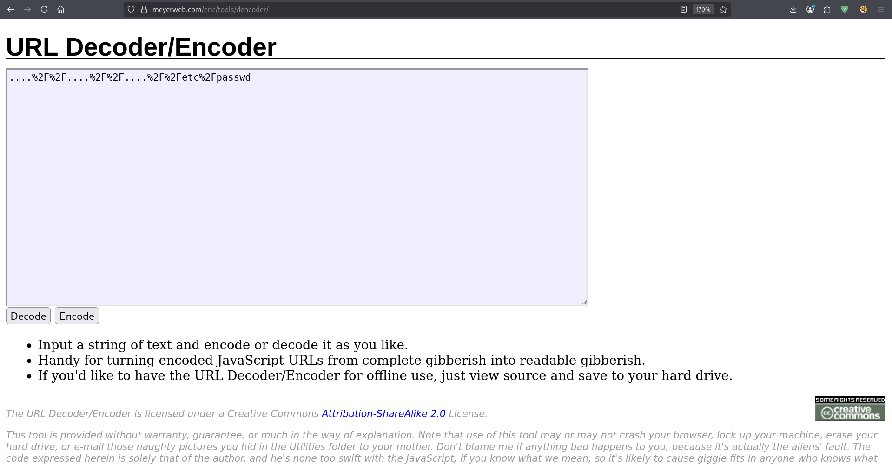
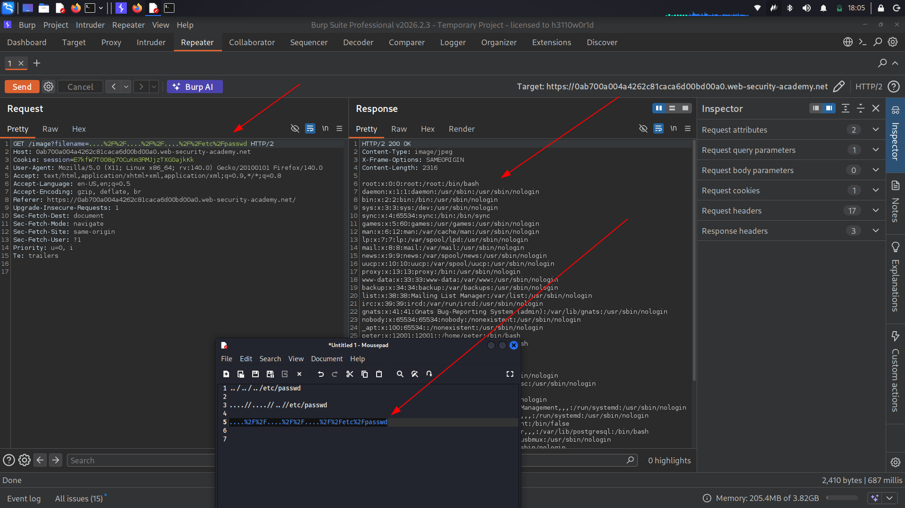

Target: https://0a41004404edcb9c8164ac9500a90013.web-security-academy.net/

Platform: Portswigger 

Date: 13/03/2026

Objective: Retrieve contents of **/etc/passwd**

RECON




The website is an e-commerce website.



Identifying the target:




EXPLOITATION

Now since the site requires path traversal with superfulous url-decode, i first intercepted the request and sent it to repeater to analyze whats going on.
I came up with a methodology of the payloads i would try to use on the target to detect this vulnerability.

```
payloads
	- 	../../../etc/passwd
	-	/etc/passwd
	-	....//....//....//etc/passwd

```
Now having this basic payload, the only thing remaining was to encode them and try to exploit with them.
Sending them without encoding would be easily detected and hence i tried basic online url  encoder to avoid detection.



Sending the ** ....//....//...//etc/passwd ** as an encoded payload worked.
Now completing the objective.




