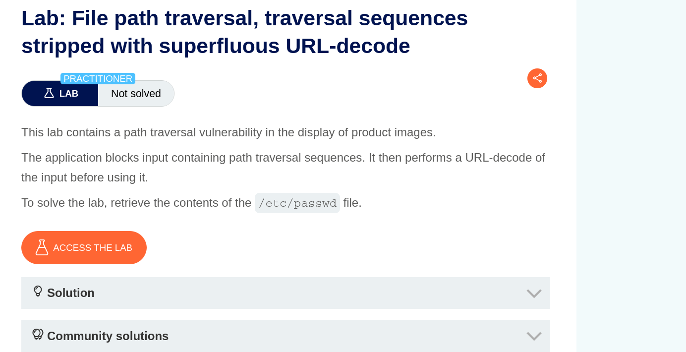
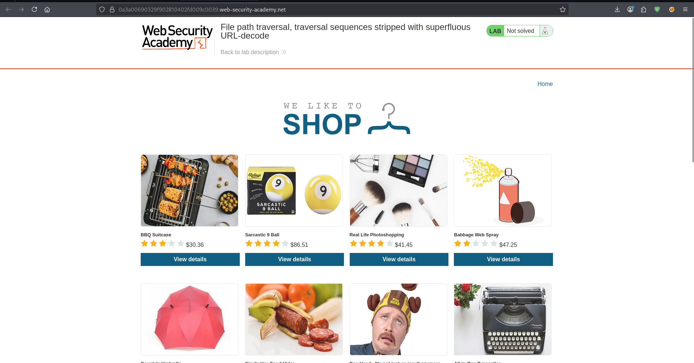
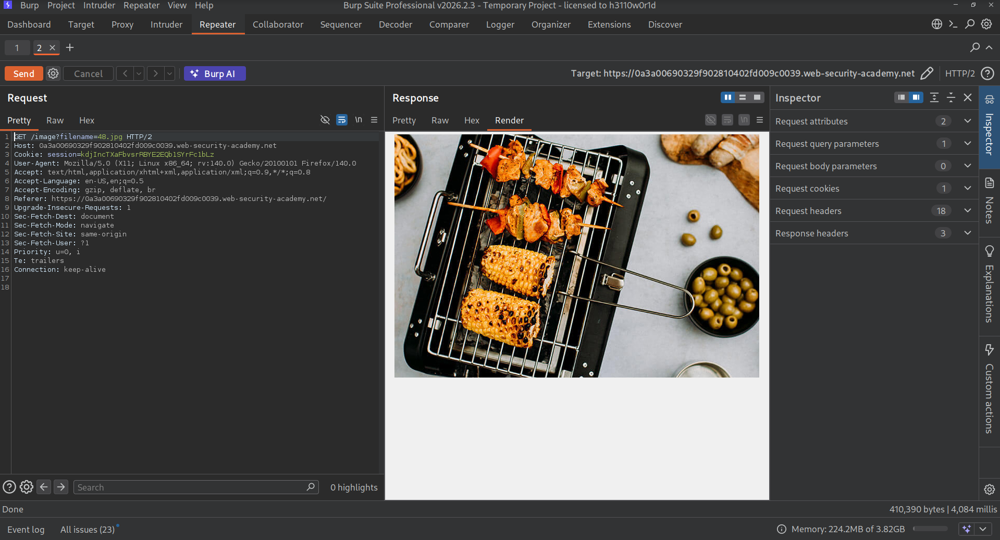
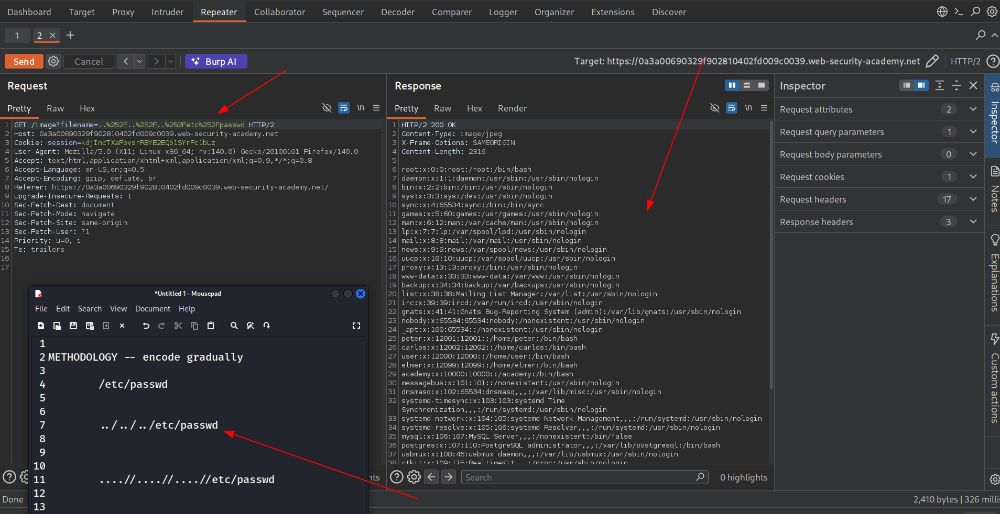
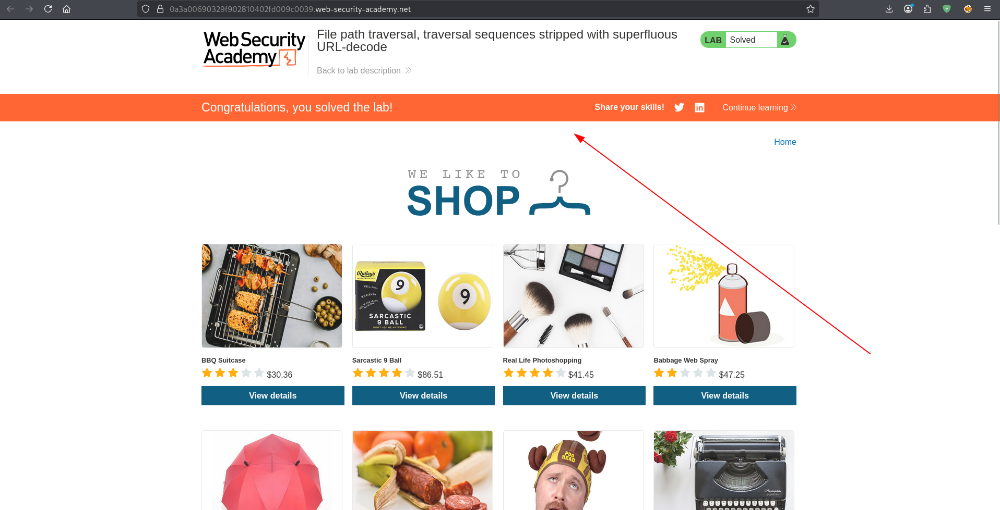

TARGET : https://0a41004404edcb9c8164ac9500a90013.web-security-academy.net/

PLATFORM : Portswigger

DATE : 13/03/2026

OBJECTIVE : Retrieve contents of **/etc/passwd**


Target:



RECON

The website is an e-commerce website.



Now this labs tests path traversal where the payload has to be encoded several times since the site decodes the payload for detection.

Capturing the request  with burp reveals the query for the file.



Payloads to try on the target site:
```

-	/etc/passwd

-	../../../etc/passwd

-	....//....//....//etc/passwd

-- all followed by a series of encoding
```

Trying  encoded **../../../etc/passwd** worked completing the objective.



And having completed that objective the task was over.


