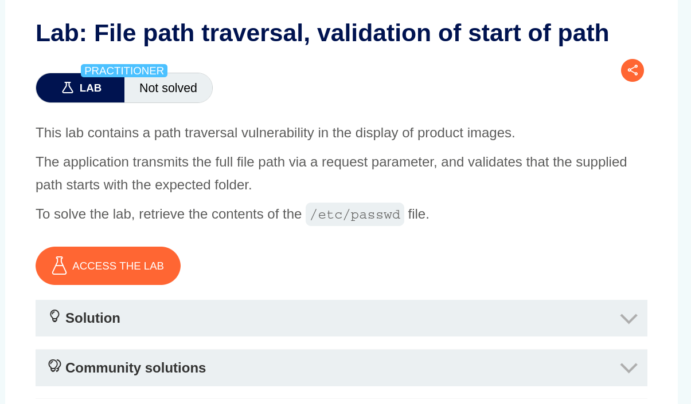
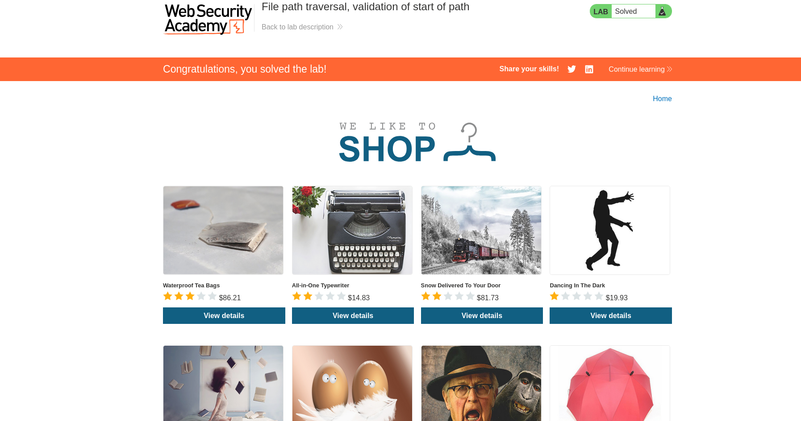
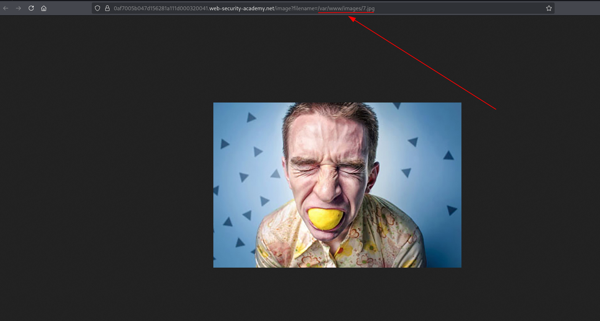
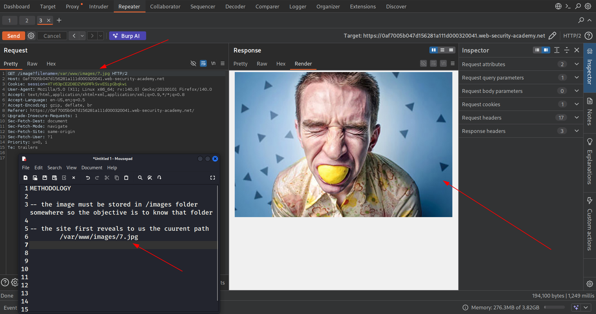
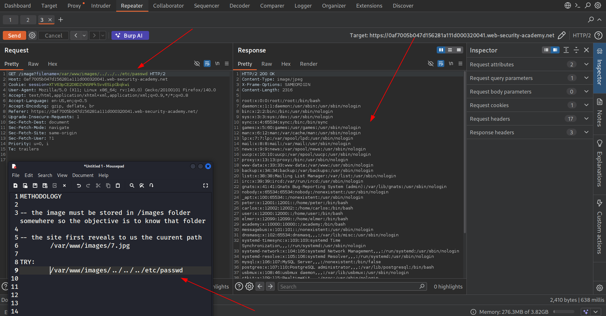

TARGET: https://0a41004404edcb9c8164ac95063cd90013.web-security-academy.net/

PLATFORM: portswigger

DATE: 13/03/2026

OBJECTIVE : Retrieve contents of /etc/passwd 


The target:



The target website is an e-commerce site.



RECON

The recon started with identifying any image query in the url which would allow path traversal and read file in the system.



This lab specifically focuses on path traversal via validation of start path.

From the basic request we identify the site reveals it path to the image:



Now we know  the base directory is **/var/www/images**


What if we use this path to access the /etc/passwd file in the system by just crafting a basic payload using the path.
```
payload --

	
	/var/www/images/../../../etc/passwd

```
Now completing the objective of reading the contents of **/etc/passwd**



