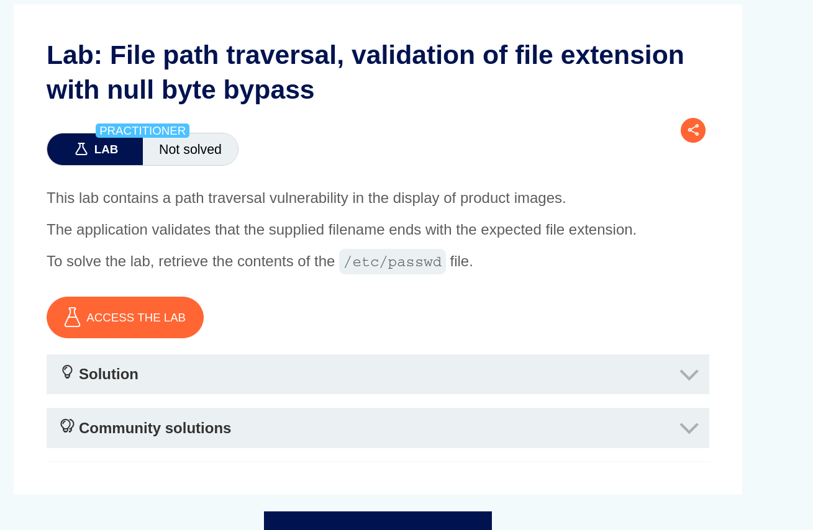
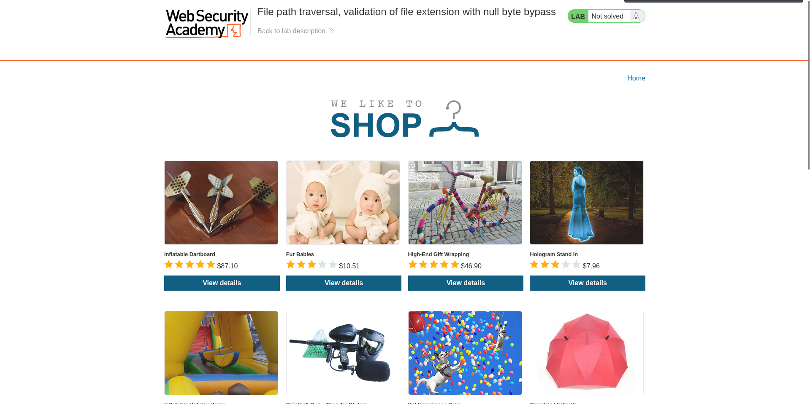
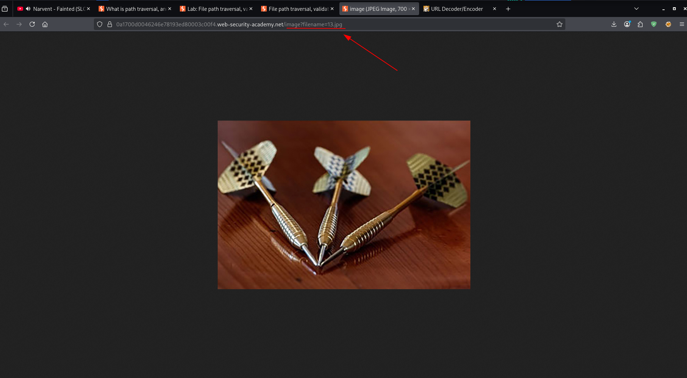
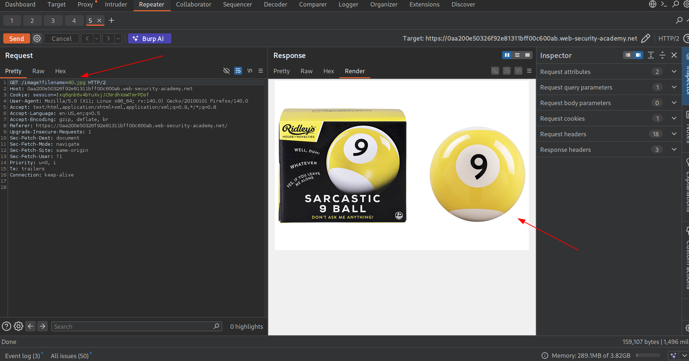
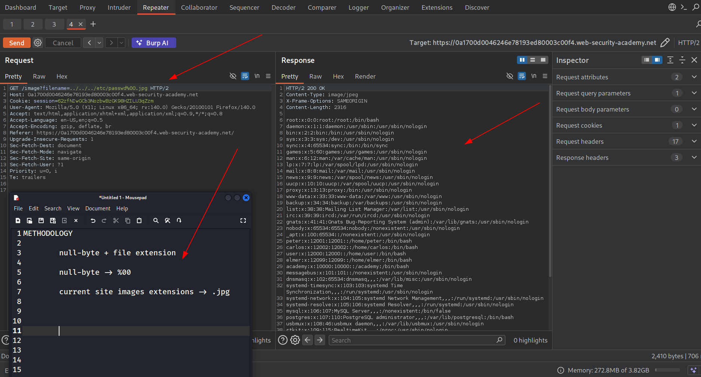

TARGET: https://0a41004404edcb9c8164cab95063cd90013.web-security-academy.net/

PLATFORM: portswigger

DATE: 13/03/2026

OBJECTIVE : Retrieve contents of /etc/passwd

The target:



The target website is an e-commerce site.



RECON

The recon started with identifying any image query in the url which would allow path traversal and read file in the system.



This lab specifically focuses on path traversal via use of null byte:
```
null-byte 

	%00 or \x00 -- role is to truncate file paths and bypass file extension validation.

```
The developers made it in such a way that every file to be retrieved must have a certain file extension eg .jpg 

Basic request to the site reveals:



Now to reveal the contents of **/etc/passwd** we need to use null byte plus the site's images files extension which is .jpg to avoid detection.

```
PAYLOAD

	../../../etc/passwd%00.jpg

```
Now completing the objective:


