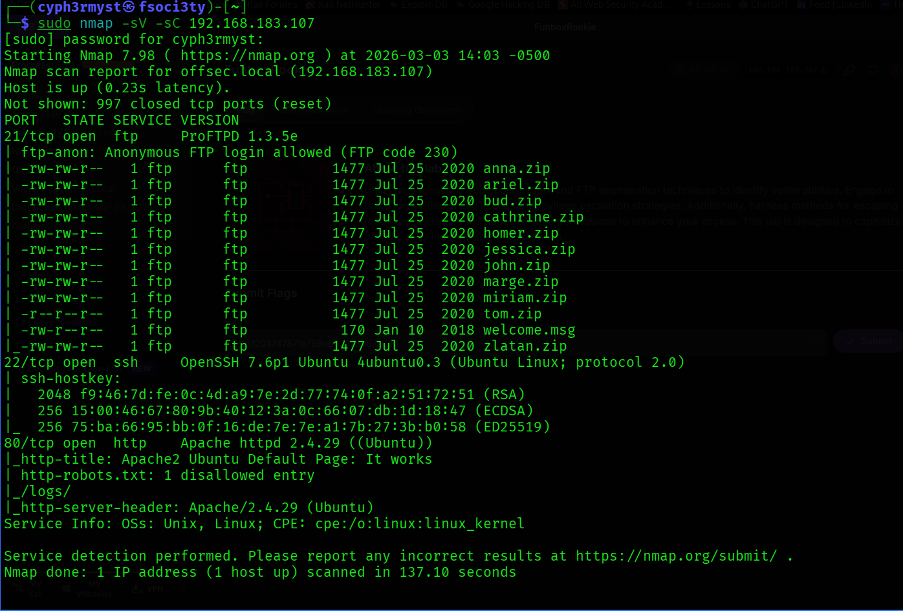
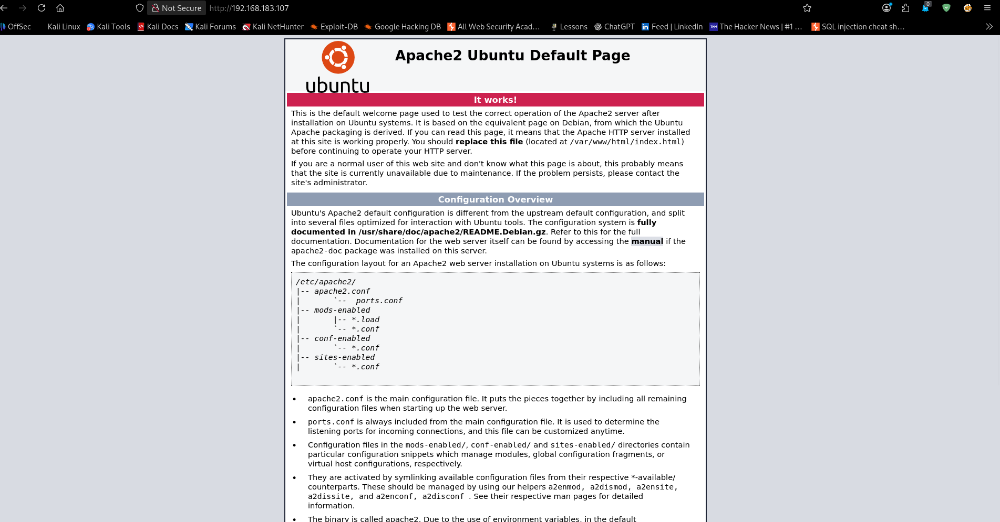
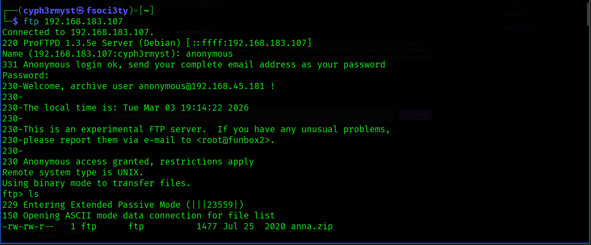
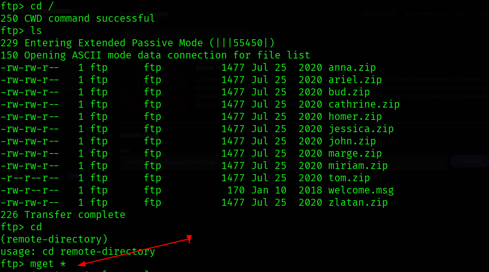
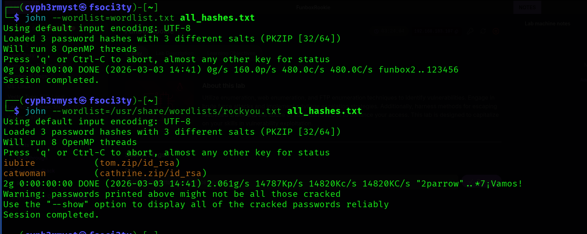
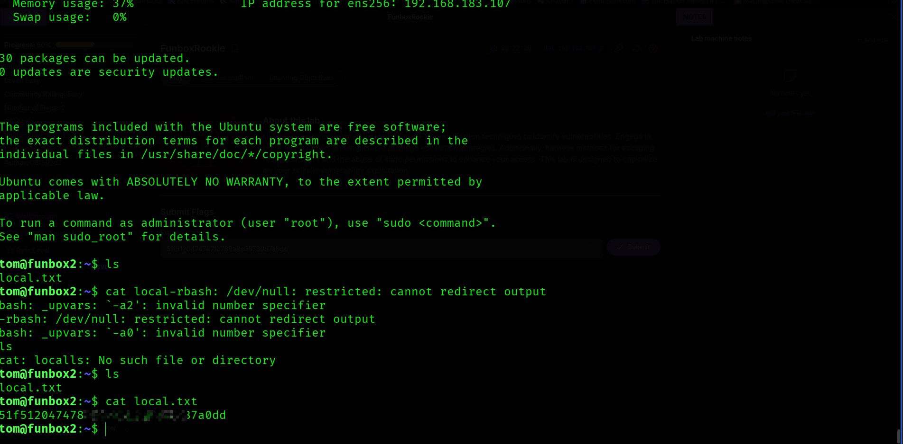
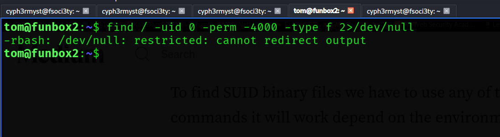
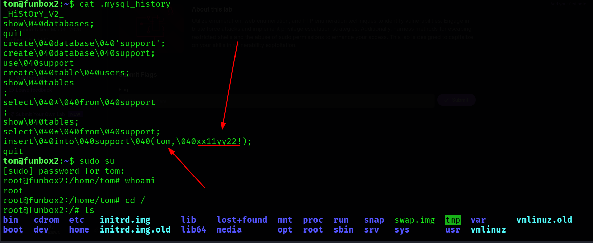
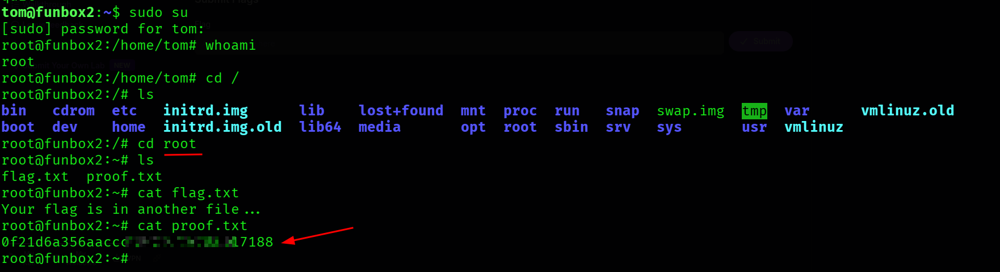

Target System: Ubuntu linux

Date: 3/3/2026

Platform: Offensive security proving grounds ctf

Difficulty: Easy


OBJECTIVE: 
Obtain two flags in the system.

RECON
Started with an Nmap scan on the system to see what services are running and what versions they are running


Port was only running the default apache page which after enumeration revealed nothing conclusive.



This really revealed alot about the system seeing that FTP allowed Anonymous login.

Login to FTP using credentials:
```
username: anonymous
password: anonymous

```

 

Some exposed zip files in the system.
This is actually a good "loot" from the system and probably gives us the next lead.
Using the FTP command **mget**
downloaded the files on my local system to see what the zip files contained and what i can get from them.



The zip files were password protected hence use tools to crack that password:
** zip2john  -- to obtain the hash** and **john the ripper  -- to crack the hash** 
.
But since the files are many,this is where the power of automation comes in,use python to crack the files password:
Python script: 

![python_script]
Cracking the zip files with python gave the following passwords:



Now having got the password,the contents of tom.zip contained an RSA private key which i would use to ssh with in to the system and Bingo it worked....first you have to ensure it has current user's permissions 
```sh
chmod 600 id_rsa
```
Now having gained access to the system i tried to find out what i could do and at first i found the first flag:



PRIVILEGE ESCALATION TACTICS 


After gaining a foothold on the system, the next objective was privilege escalation to obtain the root flag.
The system won't allow one to find existing SUID binaries.




Listing the current working directory files found a ".mysql_history" file which leaked current user's password.

The mysql history file:



Leveraging it would allow privilege escalation due to unrestricted sudo access, which allowed root user access to the system.
Now proof was "loot" root flag 

